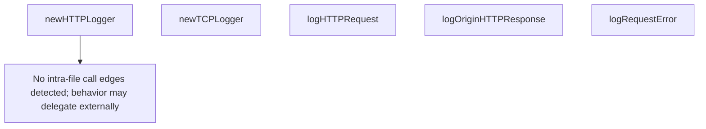

# Behavior Atom: proxy/logger.go

## Source Anchor

- Go source: [cloudflare/cloudflared@2026.3.0/proxy/logger.go](https://github.com/cloudflare/cloudflared/blob/2026.3.0/proxy/logger.go)
- Package: proxy
- Module group: proxy

## Behavioral Responsibility

Ingress matching and origin dispatch behavior.

## Entry Points

- No exported/main/init entry point detected; behavior is internal support logic.

## Internal Function Surface

- newHTTPLogger(logger *zerolog.Logger, connIndex uint8, req*http.Request, rule int, serviceName string) zerolog.Logger (line 29)
- newTCPLogger(logger *zerolog.Logger, req*connection.TCPRequest) zerolog.Logger (line 48)
- logHTTPRequest(logger *zerolog.Logger, r*http.Request) (line 60)
- logOriginHTTPResponse(logger *zerolog.Logger, resp*http.Response) (line 70)
- logRequestError(logger *zerolog.Logger, err error) (line 78)

## Input Contract

- HTTP requests
- func-param:connIndex uint8
- func-param:err error
- func-param:logger *zerolog.Logger
- func-param:r *http.Request
- func-param:req *connection.TCPRequest
- func-param:req *http.Request
- func-param:resp *http.Response
- func-param:rule int
- func-param:serviceName string

## Output Contract

- return:zerolog.Logger
- stdout/stderr or structured logs

## Side Effects and State Transitions

- network I/O

## Branching and Failure Semantics

- Branch density: if=2, switch=0, select=0
- error-return paths

## Import and Dependency Surface

- github.com/cloudflare/cloudflared/connection
- github.com/cloudflare/cloudflared/ingress
- github.com/cloudflare/cloudflared/management
- github.com/rs/zerolog
- net/http
- strconv

## Go-Impl Flow (Intra-file)

## Rust Porting Notes

- **Logging helpers**: `zerolog`-based request/connection logging → `tracing::info!`/`tracing::error!` with structured fields.
- **Quirk — 2 if-branches**: Conditional log levels; use `tracing::event!` with dynamic level.

## Accuracy Notes

- Generated from Go AST parsing and source text pattern extraction.
- Source link is authoritative for disputed semantics; keep this atom synchronized with the linked file.
