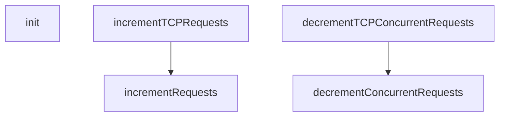

# Behavior Atom: proxy/metrics.go

## Source Anchor

- Go source: [cloudflare/cloudflared@2026.3.0/proxy/metrics.go](https://github.com/cloudflare/cloudflared/blob/2026.3.0/proxy/metrics.go)
- Package: proxy
- Module group: proxy

## Behavioral Responsibility

Ingress matching and origin dispatch behavior.

## Entry Points

- init() (line 81)

## Internal Function Surface

- incrementRequests() (line 94)
- decrementConcurrentRequests() (line 99)
- incrementTCPRequests() (line 103)
- decrementTCPConcurrentRequests() (line 109)

## Input Contract

- Inputs are indirect through callers; no direct input pattern detected statically.

## Output Contract

- metrics emission

## Side Effects and State Transitions

- No high-signal side effect pattern detected in static scan.

## Branching and Failure Semantics

- Branch density: if=0, switch=0, select=0
- No explicit failure pattern markers found in static scan.

## Import and Dependency Surface

- github.com/cloudflare/cloudflared/connection
- github.com/prometheus/client_golang/prometheus

## Go-Impl Flow (Intra-file)

## Rust Porting Notes

- **init() + Prometheus**: `init()` registering counters + simple increment wrappers → `once_cell::sync::Lazy<prometheus::IntCounter>`.
- **Quirk — zero branching**: Pure declarations; direct translation.

## Accuracy Notes

- Generated from Go AST parsing and source text pattern extraction.
- Source link is authoritative for disputed semantics; keep this atom synchronized with the linked file.
