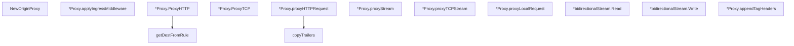

# Behavior Atom: proxy/proxy.go

## Source Anchor

- Go source: [cloudflare/cloudflared@2026.3.0/proxy/proxy.go](https://github.com/cloudflare/cloudflared/blob/2026.3.0/proxy/proxy.go)
- Package: proxy
- Module group: proxy

## Behavioral Responsibility

Ingress matching and origin dispatch behavior.

## Entry Points

- NewOriginProxy(ingressRules ingress.Ingress, originDialer ingress.OriginDialer, tags []pogs.Tag, flowLimiter cfdflow.Limiter, log *zerolog.Logger)*Proxy (line 45)
- (*Proxy) ProxyHTTP(w connection.ResponseWriter, tr*tracing.TracedHTTPRequest, isWebsocket bool) error (line 80)
- (*Proxy) ProxyTCP(ctx context.Context, conn connection.ReadWriteAcker, req*connection.TCPRequest) error (line 145)
- (*bidirectionalStream) Read(p []byte) (n int, err error) (line 367)
- (*bidirectionalStream) Write(p []byte) (n int, err error) (line 371)

## Internal Function Surface

- (*Proxy) applyIngressMiddleware(rule*ingress.Rule, r *http.Request, w connection.ResponseWriter) (error, bool) (line 63)
- (*Proxy) proxyHTTPRequest(w connection.ResponseWriter, tr*tracing.TracedHTTPRequest, httpService ingress.HTTPOriginProxy, isWebsocket bool, disableChunkedEncoding bool, logger *zerolog.Logger) error (line 186)
- (*Proxy) proxyStream(tr*tracing.TracedContext, rwa connection.ReadWriteAcker, dest string, originDialer ingress.StreamBasedOriginProxy, logger *zerolog.Logger) error (line 277)
- (*Proxy) proxyTCPStream(tr*tracing.TracedContext, tunnelConn connection.ReadWriteAcker, dest netip.AddrPort, originDialer ingress.OriginTCPDialer, logger *zerolog.Logger) error (line 316)
- (*Proxy) proxyLocalRequest(proxy ingress.HTTPLocalProxy, w connection.ResponseWriter, req*http.Request, isWebsocket bool) (line 351)
- (*Proxy) appendTagHeaders(r*http.Request) (line 375)
- copyTrailers(w connection.ResponseWriter, response *http.Response) (line 381)
- getDestFromRule(rule *ingress.Rule, req*http.Request) (string, error) (line 389)

## Input Contract

- HTTP requests
- func-param:conn connection.ReadWriteAcker
- func-param:ctx context.Context
- func-param:dest netip.AddrPort
- func-param:dest string
- func-param:disableChunkedEncoding bool
- func-param:flowLimiter cfdflow.Limiter
- func-param:httpService ingress.HTTPOriginProxy
- func-param:ingressRules ingress.Ingress
- func-param:isWebsocket bool
- func-param:log *zerolog.Logger
- func-param:logger *zerolog.Logger
- func-param:originDialer ingress.OriginDialer
- func-param:originDialer ingress.OriginTCPDialer
- func-param:originDialer ingress.StreamBasedOriginProxy
- func-param:p []byte
- func-param:proxy ingress.HTTPLocalProxy
- func-param:r *http.Request
- func-param:req *connection.TCPRequest
- func-param:req *http.Request
- func-param:response *http.Response
- func-param:rule *ingress.Rule
- func-param:rwa connection.ReadWriteAcker
- func-param:tags []pogs.Tag
- func-param:tr *tracing.TracedContext
- func-param:tr *tracing.TracedHTTPRequest
- func-param:tunnelConn connection.ReadWriteAcker
- func-param:w connection.ResponseWriter

## Output Contract

- HTTP response writes
- return:*Proxy
- return:bool
- return:err error
- return:error
- return:n int
- return:string
- stdout/stderr or structured logs

## Side Effects and State Transitions

- network I/O

## Branching and Failure Semantics

- Branch density: if=26, switch=2, select=0
- error-return paths
- fallback/default branches

## Import and Dependency Surface

- context
- fmt
- github.com/cloudflare/cloudflared/carrier
- github.com/cloudflare/cloudflared/cfio
- github.com/cloudflare/cloudflared/connection
- github.com/cloudflare/cloudflared/flow
- github.com/cloudflare/cloudflared/ingress
- github.com/cloudflare/cloudflared/management
- github.com/cloudflare/cloudflared/stream
- github.com/cloudflare/cloudflared/tracing
- github.com/cloudflare/cloudflared/tunnelrpc/pogs
- github.com/pkg/errors
- github.com/rs/zerolog
- go.opentelemetry.io/otel/attribute
- go.opentelemetry.io/otel/trace
- io
- net/http
- net/netip
- strconv
- time

## Go-Impl Flow (Intra-file)

## Rust Porting Notes

- **Core dispatch**: Multiple origin proxy interfaces (`HTTPOriginProxy`, `StreamBasedOriginProxy`, `OriginTCPDialer`) → `enum OriginHandler { Http(Box<dyn HttpProxy>), Stream(Box<dyn StreamProxy>), Tcp(Box<dyn TcpDialer>) }` with `match` dispatch.
- **OpenTelemetry tracing**: `otel` span creation around proxy calls → `#[tracing::instrument]` with `opentelemetry` integration.
- **Bidirectional streaming**: `io.Copy` goroutine pairs for stream proxying → `tokio::io::copy_bidirectional()`.
- **Quirk — 26 if + 2 switch**: Highest branching among remaining atoms; decompose into per-handler proxy methods.

## Accuracy Notes

- Generated from Go AST parsing and source text pattern extraction.
- Source link is authoritative for disputed semantics; keep this atom synchronized with the linked file.
