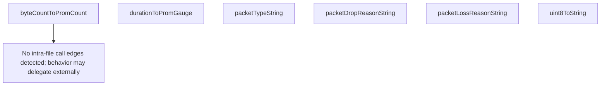

# Behavior Atom: quic/conversion.go

## Source Anchor

- Go source: [cloudflare/cloudflared@2026.3.0/quic/conversion.go](https://github.com/cloudflare/cloudflared/blob/2026.3.0/quic/conversion.go)
- Package: quic
- Module group: quic

## Behavioral Responsibility

Transport/protocol behavior for edge-origin data and control flows.

## Entry Points

- No exported/main/init entry point detected; behavior is internal support logic.

## Internal Function Surface

- byteCountToPromCount(count logging.ByteCount) float64 (line 11)
- durationToPromGauge(duration time.Duration) float64 (line 16)
- packetTypeString(pt logging.PacketType) string (line 21)
- packetDropReasonString(reason logging.PacketDropReason) string (line 45)
- packetLossReasonString(reason logging.PacketLossReason) string (line 75)
- uint8ToString(input uint8) string (line 86)

## Input Contract

- func-param:count logging.ByteCount
- func-param:duration time.Duration
- func-param:input uint8
- func-param:pt logging.PacketType
- func-param:reason logging.PacketDropReason
- func-param:reason logging.PacketLossReason

## Output Contract

- metrics emission
- return:float64
- return:string

## Side Effects and State Transitions

- No high-signal side effect pattern detected in static scan.

## Branching and Failure Semantics

- Branch density: if=0, switch=3, select=0
- fallback/default branches

## Import and Dependency Surface

- github.com/quic-go/quic-go/logging
- strconv
- time

## Go-Impl Flow (Intra-file)

## Rust Porting Notes

- **Enum-to-string switches**: `packetTypeString()`, `packetDropReasonString()`, `packetLossReasonString()` use `switch` over `quic-go/logging` enum types → implement `Display` on equivalent Rust enums via `match` arms; if the upstream `quinn` crate exposes different enum variants, adjust mapping.
- **Metric conversions**: `byteCountToPromCount()` and `durationToPromGauge()` cast to `float64` → in Rust, use `as f64` casts; `Duration::as_secs_f64()` replaces manual duration conversion.
- **External type dependency**: Conversion targets are `quic-go/logging` types → the Rust equivalent is `quinn::ConnectionStats` or `quinn_proto` metric types; function signatures will change accordingly.
- **Quirk — uint8ToString**: Duplicates the same utility from `connection/connection.go` → consolidate into a shared utility in the Rust port.

## Accuracy Notes

- Generated from Go AST parsing and source text pattern extraction.
- Source link is authoritative for disputed semantics; keep this atom synchronized with the linked file.
