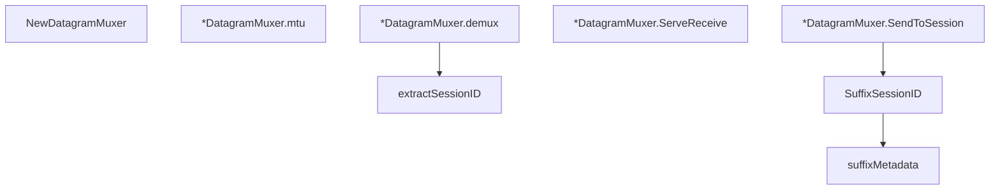

# Behavior Atom: quic/datagram.go

## Source Anchor

- Go source: [cloudflare/cloudflared@2026.3.0/quic/datagram.go](https://github.com/cloudflare/cloudflared/blob/2026.3.0/quic/datagram.go)
- Package: quic
- Module group: quic

## Behavioral Responsibility

Transport/protocol behavior for edge-origin data and control flows.

## Entry Points

- NewDatagramMuxer(quicSession quic.Connection, log *zerolog.Logger, demuxChan chan<-*packet.Session) *DatagramMuxer (line 33)
- (*DatagramMuxer) SendToSession(session*packet.Session) error (line 47)
- (*DatagramMuxer) ServeReceive(ctx context.Context) error (line 62)
- SuffixSessionID(sessionID uuid.UUID, b []byte) ([]byte, error) (line 115)

## Internal Function Surface

- (*DatagramMuxer) mtu() int (line 43)
- (*DatagramMuxer) demux(ctx context.Context, msg []byte) error (line 80)
- extractSessionID(b []byte) (uuid.UUID, []byte, error) (line 99)
- suffixMetadata(payload []byte, metadata []byte) ([]byte, error) (line 119)

## Input Contract

- func-param:b []byte
- func-param:ctx context.Context
- func-param:demuxChan chan<- *packet.Session
- func-param:log *zerolog.Logger
- func-param:metadata []byte
- func-param:msg []byte
- func-param:payload []byte
- func-param:quicSession quic.Connection
- func-param:session *packet.Session
- func-param:sessionID uuid.UUID

## Output Contract

- return:*DatagramMuxer
- return:[]byte
- return:error
- return:int
- return:uuid.UUID
- stdout/stderr or structured logs

## Side Effects and State Transitions

- network I/O

## Branching and Failure Semantics

- Branch density: if=10, switch=0, select=1
- error-return paths

## Import and Dependency Surface

- context
- fmt
- github.com/cloudflare/cloudflared/packet
- github.com/google/uuid
- github.com/pkg/errors
- github.com/quic-go/quic-go
- github.com/rs/zerolog

## Go-Impl Flow (Intra-file)

## Rust Porting Notes

- **DatagramMuxer**: Multiplexes QUIC datagrams to sessions via channel → `quinn::Connection::send_datagram()` / `read_datagram()` with `tokio::sync::mpsc` dispatch to per-session handlers.
- **ServeReceive loop**: Goroutine reading datagrams in a loop with `select` on context cancellation → `tokio::select!` over `connection.read_datagram()` and `cancellation_token.cancelled()`.
- **Session ID framing**: UUID suffix/extract on byte slices → use `uuid::Uuid` with `as_bytes()` / `from_slice()` for binary framing; validate slice length before extraction.
- **Channel send**: `chan<- *packet.Session` for packet dispatch → `mpsc::Sender<SessionPacket>::send().await`.
- **Quirk — 10 if-branches**: Multiple length/error checks in packet parsing; in Rust, use early-return `?` with custom error types to flatten the branch tree.

## Accuracy Notes

- Generated from Go AST parsing and source text pattern extraction.
- Source link is authoritative for disputed semantics; keep this atom synchronized with the linked file.
