# Behavior Atom: quic/datagramv2.go

## Source Anchor

- Go source: [cloudflare/cloudflared@2026.3.0/quic/datagramv2.go](https://github.com/cloudflare/cloudflared/blob/2026.3.0/quic/datagramv2.go)
- Package: quic
- Module group: quic

## Behavioral Responsibility

Transport/protocol behavior for edge-origin data and control flows.

## Entry Points

- SuffixType(b []byte, datagramType DatagramV2Type) ([]byte, error) (line 40)
- NewDatagramMuxerV2(quicSession quic.Connection, log *zerolog.Logger, sessionDemuxChan chan<-*packet.Session) *DatagramMuxerV2 (line 60)
- (*DatagramMuxerV2) SendToSession(session*packet.Session) error (line 76)
- (*DatagramMuxerV2) SendPacket(pk Packet) error (line 98)
- (*DatagramMuxerV2) ServeReceive(ctx context.Context) error (line 114)
- (*DatagramMuxerV2) ReceivePacket(ctx context.Context) (pk Packet, err error) (line 129)
- (RawPacket) Type() DatagramV2Type (line 214)
- (RawPacket) Payload() []byte (line 218)
- (RawPacket) Metadata() []byte (line 222)
- (*TracedPacket) Type() DatagramV2Type (line 231)
- (*TracedPacket) Payload() []byte (line 235)
- (*TracedPacket) Metadata() []byte (line 239)
- (*TracingSpanPacket) Type() DatagramV2Type (line 248)
- (*TracingSpanPacket) Payload() []byte (line 252)
- (*TracingSpanPacket) Metadata() []byte (line 256)

## Internal Function Surface

- (*DatagramMuxerV2) mtu() int (line 49)
- (*DatagramMuxerV2) demux(ctx context.Context, msgWithType []byte) error (line 138)
- (*DatagramMuxerV2) handleSession(ctx context.Context, session []byte) error (line 152)
- (*DatagramMuxerV2) handlePacket(ctx context.Context, pk []byte, msgType DatagramV2Type) error (line 169)
- extractTracingIdentity(pk []byte) (tracingIdentity []byte, payload []byte, err error) (line 203)

## Input Contract

- func-param:b []byte
- func-param:ctx context.Context
- func-param:datagramType DatagramV2Type
- func-param:log *zerolog.Logger
- func-param:msgType DatagramV2Type
- func-param:msgWithType []byte
- func-param:pk Packet
- func-param:pk []byte
- func-param:quicSession quic.Connection
- func-param:session *packet.Session
- func-param:session []byte
- func-param:sessionDemuxChan chan<- *packet.Session

## Output Contract

- return:*DatagramMuxerV2
- return:DatagramV2Type
- return:[]byte
- return:err error
- return:error
- return:int
- return:payload []byte
- return:pk Packet
- return:tracingIdentity []byte
- stdout/stderr or structured logs

## Side Effects and State Transitions

- network I/O

## Branching and Failure Semantics

- Branch density: if=16, switch=2, select=3
- error-return paths
- fallback/default branches

## Import and Dependency Surface

- context
- fmt
- github.com/cloudflare/cloudflared/packet
- github.com/cloudflare/cloudflared/tracing
- github.com/pkg/errors
- github.com/quic-go/quic-go
- github.com/rs/zerolog

## Go-Impl Flow (Intra-file)

```mermaid
flowchart TD
    F1["SuffixType"]
    F2["*DatagramMuxerV2.mtu"]
    F3["NewDatagramMuxerV2"]
    F4["*DatagramMuxerV2.SendToSession"]
    F5["*DatagramMuxerV2.SendPacket"]
    F6["*DatagramMuxerV2.ServeReceive"]
    F7["*DatagramMuxerV2.ReceivePacket"]
    F8["*DatagramMuxerV2.demux"]
    F9["*DatagramMuxerV2.handleSession"]
    F10["*DatagramMuxerV2.handlePacket"]
    F11["extractTracingIdentity"]
    F12["RawPacket.Type"]
    F13["RawPacket.Payload"]
    F14["RawPacket.Metadata"]
    F15["*TracedPacket.Type"]
    F16["*TracedPacket.Payload"]
    F17["*TracedPacket.Metadata"]
    F18["*TracingSpanPacket.Type"]
    F19["*TracingSpanPacket.Payload"]
    F20["*TracingSpanPacket.Metadata"]
    F4 --> F1
    F5 --> F1
    F10 --> F11
```

## Rust Porting Notes

- **Packet type hierarchy**: `RawPacket`, `TracedPacket`, `TracingSpanPacket` with shared interface → Rust `enum DatagramPacket { Raw(Bytes), Traced { payload: Bytes, trace_ctx: TraceContext }, TracingSpan { ... } }` with method dispatch via `match`.
- **DatagramV2Type enum**: Packet type discriminator → `#[repr(u8)] enum DatagramV2Type` with `TryFrom<u8>` for parsing.
- **Multiple select statements**: 3 `select` blocks for concurrent channel/context operations → `tokio::select!` with proper cancellation safety annotations.
- **Type assertion dispatch**: `switch v := pkt.(type)` for polymorphic handling → `match` on the enum variants.
- **Struct embedding**: Packet types embed common fields → shared fields in enum variant data or a common inner struct.
- **Quirk — 16 if-branches + 2 switches**: Complex demux logic; decompose into a `parse_datagram(bytes) -> Result<DatagramPacket, ParseError>` function that returns typed variants.

## Accuracy Notes

- Generated from Go AST parsing and source text pattern extraction.
- Source link is authoritative for disputed semantics; keep this atom synchronized with the linked file.
