# Behavior Atom: quic/metrics.go

## Source Anchor

- Go source: [cloudflare/cloudflared@2026.3.0/quic/metrics.go](https://github.com/cloudflare/cloudflared/blob/2026.3.0/quic/metrics.go)
- Package: quic
- Module group: quic

## Behavioral Responsibility

Transport/protocol behavior for edge-origin data and control flows.

## Entry Points

- (direction) String() string (line 313)

## Internal Function Surface

- newClientCollector(index string, logger *zerolog.Logger)*clientCollector (line 199)
- (*clientCollector) startedConnection() (line 228)
- (*clientCollector) closedConnection(error) (line 232)
- (*clientCollector) receivedTransportParameters(params*logging.TransportParameters) (line 236)
- (*clientCollector) sentPackets(size logging.ByteCount, frames []logging.Frame) (line 241)
- (*clientCollector) receivedPackets(size logging.ByteCount, frames []logging.Frame) (line 245)
- (*clientCollector) bufferedPackets(packetType logging.PacketType) (line 249)
- (*clientCollector) droppedPackets(packetType logging.PacketType, size logging.ByteCount, reason logging.PacketDropReason) (line 253)
- (*clientCollector) lostPackets(reason logging.PacketLossReason) (line 261)
- (*clientCollector) updatedRTT(rtt*logging.RTTStats) (line 265)
- (*clientCollector) updateCongestionWindow(size logging.ByteCount) (line 271)
- (*clientCollector) updatedCongestionState(state logging.CongestionState) (line 275)
- (*clientCollector) updateMTU(mtu logging.ByteCount) (line 279)
- (*clientCollector) collectPackets(size logging.ByteCount, frames []logging.Frame, counter*prometheus.CounterVec, bandwidth *prometheus.CounterVec, direction direction) (line 284)
- frameName(frame logging.Frame) string (line 297)

## Input Contract

- func-param:bandwidth *prometheus.CounterVec
- func-param:counter *prometheus.CounterVec
- func-param:direction direction
- func-param:error
- func-param:frame logging.Frame
- func-param:frames []logging.Frame
- func-param:index string
- func-param:logger *zerolog.Logger
- func-param:mtu logging.ByteCount
- func-param:packetType logging.PacketType
- func-param:params *logging.TransportParameters
- func-param:reason logging.PacketDropReason
- func-param:reason logging.PacketLossReason
- func-param:rtt *logging.RTTStats
- func-param:size logging.ByteCount
- func-param:state logging.CongestionState

## Output Contract

- metrics emission
- return:*clientCollector
- return:string
- stdout/stderr or structured logs

## Side Effects and State Transitions

- concurrency primitives

## Branching and Failure Semantics

- Branch density: if=2, switch=1, select=0
- No explicit failure pattern markers found in static scan.

## Import and Dependency Surface

- github.com/prometheus/client_golang/prometheus
- github.com/quic-go/quic-go/logging
- github.com/rs/zerolog
- reflect
- strings
- sync

## Go-Impl Flow (Intra-file)

```mermaid
flowchart TD
    F1["newClientCollector"]
    F2["*clientCollector.startedConnection"]
    F3["*clientCollector.closedConnection"]
    F4["*clientCollector.receivedTransportParameters"]
    F5["*clientCollector.sentPackets"]
    F6["*clientCollector.receivedPackets"]
    F7["*clientCollector.bufferedPackets"]
    F8["*clientCollector.droppedPackets"]
    F9["*clientCollector.lostPackets"]
    F10["*clientCollector.updatedRTT"]
    F11["*clientCollector.updateCongestionWindow"]
    F12["*clientCollector.updatedCongestionState"]
    F13["*clientCollector.updateMTU"]
    F14["*clientCollector.collectPackets"]
    F15["frameName"]
    F16["direction.String"]
    F14 --> F15
```

## Rust Porting Notes

- **Callback listener pattern**: `clientCollector` implements `quic-go/logging.Tracer` callbacks → in `quinn`, use `quinn::ConnectionStats` polled periodically or implement a custom `quinn_proto::ConnectionIdGenerator` / event handler trait.
- **Reflection usage**: `reflect` package for frame type introspection → avoid reflection in Rust; use `match` on typed frame enums or `std::any::type_name` only for debug logging.
- **Direction enum**: `direction` type with `String()` → `enum Direction { Send, Recv }` with `#[derive(Display)]` from `strum`.
- **Prometheus vector labels**: Per-packet-type and per-direction metric labels → `prometheus::IntCounterVec` with `&["direction", "packet_type"]` label sets.
- **sync.Mutex state**: Metric collector holds mutable state behind mutex → `Arc<Mutex<CollectorState>>` or lock-free counters via `AtomicU64`.
- **Quirk — quinn divergence**: `quinn` does not expose the same callback API as `quic-go`; metrics may need to be collected via periodic stat polling (`Connection::stats()`) instead of event-driven callbacks.

## Accuracy Notes

- Generated from Go AST parsing and source text pattern extraction.
- Source link is authoritative for disputed semantics; keep this atom synchronized with the linked file.
