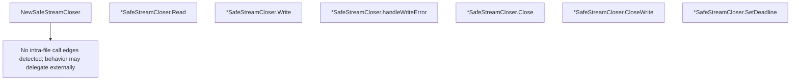

# Behavior Atom: quic/safe_stream.go

## Source Anchor

- Go source: [cloudflare/cloudflared@2026.3.0/quic/safe_stream.go](https://github.com/cloudflare/cloudflared/blob/2026.3.0/quic/safe_stream.go)
- Package: quic
- Module group: quic

## Behavioral Responsibility

Transport/protocol behavior for edge-origin data and control flows.

## Entry Points

- NewSafeStreamCloser(stream quic.Stream, writeTimeout time.Duration, log *zerolog.Logger)*SafeStreamCloser (line 26)
- (*SafeStreamCloser) Read(p []byte) (n int, err error) (line 34)
- (*SafeStreamCloser) Write(p []byte) (n int, err error) (line 38)
- (*SafeStreamCloser) Close() error (line 74)
- (*SafeStreamCloser) CloseWrite() error (line 91)
- (*SafeStreamCloser) SetDeadline(deadline time.Time) error (line 102)

## Internal Function Surface

- (*SafeStreamCloser) handleWriteError(err error) (line 56)

## Input Contract

- func-param:deadline time.Time
- func-param:err error
- func-param:log *zerolog.Logger
- func-param:p []byte
- func-param:stream quic.Stream
- func-param:writeTimeout time.Duration

## Output Contract

- HTTP response writes
- return:*SafeStreamCloser
- return:err error
- return:error
- return:n int
- stdout/stderr or structured logs

## Side Effects and State Transitions

- network I/O
- concurrency primitives

## Branching and Failure Semantics

- Branch density: if=7, switch=0, select=0
- error-return paths

## Import and Dependency Surface

- errors
- github.com/quic-go/quic-go
- github.com/rs/zerolog
- github.com/rs/zerolog/log
- net
- sync
- sync/atomic
- time

## Go-Impl Flow (Intra-file)

## Rust Porting Notes

- **SafeStreamCloser**: Wraps QUIC stream with safe-close semantics → in `quinn`, `SendStream::finish()` and `RecvStream::stop()` provide close signaling; wrap in a struct implementing `AsyncRead + AsyncWrite + Drop` for RAII cleanup.
- **Atomic state tracking**: `sync/atomic` for close-state flag → `AtomicBool` with `Ordering::SeqCst` or `Ordering::Release/Acquire` pairs.
- **Implicit net.Conn**: Satisfies `io.Reader`, `io.Writer`, `io.Closer` → implement `tokio::io::AsyncRead`, `AsyncWrite` traits explicitly.
- **Deadline enforcement**: `SetDeadline()` / `SetReadDeadline()` / `SetWriteDeadline()` → `quinn` does not support per-operation deadlines natively; use `tokio::time::timeout(duration, stream_op)` wrappers.
- **handleWriteError**: Internal error classification → `match` on `quinn::WriteError` variants (`Stopped`, `ConnectionLost`, `ClosedStream`).
- **Quirk — 7 if-branches**: Error handling branches; flatten with `?` operator and a `From<quinn::WriteError>` impl on a custom error type.

## Accuracy Notes

- Generated from Go AST parsing and source text pattern extraction.
- Source link is authoritative for disputed semantics; keep this atom synchronized with the linked file.
