# Behavior Atom: quic/tracing.go

## Source Anchor

- Go source: [cloudflare/cloudflared@2026.3.0/quic/tracing.go](https://github.com/cloudflare/cloudflared/blob/2026.3.0/quic/tracing.go)
- Package: quic
- Module group: quic

## Behavioral Responsibility

Transport/protocol behavior for edge-origin data and control flows.

## Entry Points

- NewClientTracer(logger *zerolog.Logger, index uint8) (func(context.Context, logging.Perspective, logging.ConnectionID)*logging.ConnectionTracer) (line 17)
- (*tracer) TracerForConnection(_ctx context.Context,_p logging.Perspective, _odcid logging.ConnectionID)*logging.ConnectionTracer (line 25)
- (*connTracer) StartedConnection(local net.Addr, remote net.Addr, srcConnID logging.ConnectionID, destConnID logging.ConnectionID) (line 55)
- (*connTracer) ClosedConnection(err error) (line 59)
- (*connTracer) ReceivedTransportParameters(params*logging.TransportParameters) (line 63)
- (*connTracer) BufferedPacket(pt logging.PacketType, size logging.ByteCount) (line 67)
- (*connTracer) DroppedPacket(pt logging.PacketType, number logging.PacketNumber, size logging.ByteCount, reason logging.PacketDropReason) (line 71)
- (*connTracer) LostPacket(level logging.EncryptionLevel, number logging.PacketNumber, reason logging.PacketLossReason) (line 75)
- (*connTracer) UpdatedMetrics(rttStats*logging.RTTStats, cwnd logging.ByteCount, bytesInFlight logging.ByteCount, packetsInFlight int) (line 79)
- (*connTracer) SentLongHeaderPacket(hdr*logging.ExtendedHeader, size logging.ByteCount, ecn logging.ECN, ack *logging.AckFrame, frames []logging.Frame) (line 84)
- (*connTracer) SentShortHeaderPacket(hdr*logging.ShortHeader, size logging.ByteCount, ecn logging.ECN, ack *logging.AckFrame, frames []logging.Frame) (line 88)
- (*connTracer) ReceivedLongHeaderPacket(hdr*logging.ExtendedHeader, size logging.ByteCount, ecn logging.ECN, frames []logging.Frame) (line 92)
- (*connTracer) ReceivedShortHeaderPacket(hdr*logging.ShortHeader, size logging.ByteCount, ecn logging.ECN, frames []logging.Frame) (line 96)
- (*connTracer) UpdatedMTU(mtu logging.ByteCount, done bool) (line 100)
- (*connTracer) UpdatedCongestionState(state logging.CongestionState) (line 104)

## Internal Function Surface

- newConnTracer(metricsCollector *clientCollector)*logging.ConnectionTracer (line 34)

## Input Contract

- func-param:_ctx context.Context
- func-param:_odcid logging.ConnectionID
- func-param:_p logging.Perspective
- func-param:ack *logging.AckFrame
- func-param:bytesInFlight logging.ByteCount
- func-param:cwnd logging.ByteCount
- func-param:destConnID logging.ConnectionID
- func-param:done bool
- func-param:ecn logging.ECN
- func-param:err error
- func-param:frames []logging.Frame
- func-param:hdr *logging.ExtendedHeader
- func-param:hdr *logging.ShortHeader
- func-param:index uint8
- func-param:level logging.EncryptionLevel
- func-param:local net.Addr
- func-param:logger *zerolog.Logger
- func-param:metricsCollector *clientCollector
- func-param:mtu logging.ByteCount
- func-param:number logging.PacketNumber
- func-param:packetsInFlight int
- func-param:params *logging.TransportParameters
- func-param:pt logging.PacketType
- func-param:reason logging.PacketDropReason
- func-param:reason logging.PacketLossReason
- func-param:remote net.Addr
- func-param:rttStats *logging.RTTStats
- func-param:size logging.ByteCount
- func-param:srcConnID logging.ConnectionID
- func-param:state logging.CongestionState

## Output Contract

- return:*logging.ConnectionTracer
- return:func(context.Context, logging.Perspective, logging.ConnectionID) *logging.ConnectionTracer
- stdout/stderr or structured logs

## Side Effects and State Transitions

- network I/O

## Branching and Failure Semantics

- Branch density: if=0, switch=0, select=0
- error-return paths

## Import and Dependency Surface

- context
- github.com/quic-go/quic-go/logging
- github.com/rs/zerolog
- net

## Go-Impl Flow (Intra-file)

```mermaid
flowchart TD
    F1["NewClientTracer"]
    F2["*tracer.TracerForConnection"]
    F3["newConnTracer"]
    F4["*connTracer.StartedConnection"]
    F5["*connTracer.ClosedConnection"]
    F6["*connTracer.ReceivedTransportParameters"]
    F7["*connTracer.BufferedPacket"]
    F8["*connTracer.DroppedPacket"]
    F9["*connTracer.LostPacket"]
    F10["*connTracer.UpdatedMetrics"]
    F11["*connTracer.SentLongHeaderPacket"]
    F12["*connTracer.SentShortHeaderPacket"]
    F13["*connTracer.ReceivedLongHeaderPacket"]
    F14["*connTracer.ReceivedShortHeaderPacket"]
    F15["*connTracer.UpdatedMTU"]
    F16["*connTracer.UpdatedCongestionState"]
    F2 --> F3
```

## Rust Porting Notes

- **Higher-order tracer factory**: `NewClientTracer()` returns `func(context.Context, ...) *logging.ConnectionTracer` → in Rust, return `Box<dyn Fn(...) -> Box<dyn ConnectionTracer>>` or use a trait with associated type for the per-connection tracer.
- **Callback methods**: ~8 tracer callbacks (StartedConnection, ClosedConnection, DroppedPacket, etc.) → implement a trait or use `quinn`'s built-in `ConnectionStats` polling; `quinn` does not expose a callback-based tracing API identical to `quic-go`.
- **Zerolog integration**: Logger passed into tracer → use `tracing::Span` with structured fields per connection event.
- **Quirk — zero branching**: All callbacks are unconditional event emitters; the Rust port should be equally simple — `tracing::debug!` calls per event with structured fields.

## Accuracy Notes

- Generated from Go AST parsing and source text pattern extraction.
- Source link is authoritative for disputed semantics; keep this atom synchronized with the linked file.
