# Behavior Atom: quic/v3/datagram.go

## Source Anchor

- Go source: [cloudflare/cloudflared@2026.3.0/quic/v3/datagram.go](https://github.com/cloudflare/cloudflared/blob/2026.3.0/quic/v3/datagram.go)
- Package: v3
- Module group: quic

## Behavioral Responsibility

Transport/protocol behavior for edge-origin data and control flows.

## Entry Points

- ParseDatagramType(data []byte) (DatagramType, error) (line 30)
- (*UDPSessionRegistrationDatagram) MarshalBinary() (data []byte, err error) (line 91)
- (*UDPSessionRegistrationDatagram) UnmarshalBinary(data []byte) error (line 142)
- MarshalPayloadHeaderTo(requestID RequestID, payload []byte) error (line 224)
- (*UDPSessionPayloadDatagram) UnmarshalBinary(data []byte) error (line 232)
- (*UDPSessionRegistrationResponseDatagram) MarshalBinary() (data []byte, err error) (line 312)
- (*UDPSessionRegistrationResponseDatagram) UnmarshalBinary(data []byte) error (line 335)
- (*ICMPDatagram) MarshalBinary() (data []byte, err error) (line 396)
- (*ICMPDatagram) UnmarshalBinary(data []byte) error (line 411)

## Internal Function Surface

- None detected.

## Input Contract

- func-param:data []byte
- func-param:payload []byte
- func-param:requestID RequestID

## Output Contract

- return:DatagramType
- return:data []byte
- return:err error
- return:error

## Side Effects and State Transitions

- No high-signal side effect pattern detected in static scan.

## Branching and Failure Semantics

- Branch density: if=35, switch=0, select=0
- error-return paths

## Import and Dependency Surface

- encoding/binary
- net/netip
- time

## Go-Impl Flow (Intra-file)

```mermaid
flowchart TD
    F1["ParseDatagramType"]
    F2["*UDPSessionRegistrationDatagram.MarshalBinary"]
    F3["*UDPSessionRegistrationDatagram.UnmarshalBinary"]
    F4["MarshalPayloadHeaderTo"]
    F5["*UDPSessionPayloadDatagram.UnmarshalBinary"]
    F6["*UDPSessionRegistrationResponseDatagram.MarshalBinary"]
    F7["*UDPSessionRegistrationResponseDatagram.UnmarshalBinary"]
    F8["*ICMPDatagram.MarshalBinary"]
    F9["*ICMPDatagram.UnmarshalBinary"]
    F3 --> F1
    F5 --> F1
    F7 --> F1
    F9 --> F1
```

## Rust Porting Notes

- **Binary codec**: `MarshalBinary()` / `UnmarshalBinary()` on 4+ datagram types with `encoding/binary.BigEndian` → use the `byteorder` crate (`ReadBytesExt`, `WriteBytesExt`) or `u32::from_be_bytes()` / `to_be_bytes()` for zero-dependency parsing.
- **DatagramType enum**: Discriminator byte at message start → `#[repr(u8)] enum DatagramType` with `TryFrom<u8>` returning `Result<Self, UnknownDatagramType>`.
- **Message types**: `UDPSessionRegistrationDatagram`, `UDPSessionPayloadDatagram`, `ICMPDatagram`, etc. → Rust `enum Datagram { Registration { ... }, Payload { ... }, RegistrationResponse { ... }, Icmp { ... } }` with per-variant `marshal/unmarshal` via trait or method.
- **netip types**: `netip.Addr`, `netip.AddrPort` → `std::net::IpAddr`, `std::net::SocketAddr`; binary encoding via `Ipv4Addr::octets()` / `Ipv6Addr::octets()`.
- **Quirk — 35 if-branches**: Heavy validation during deserialization; use `nom` or manual cursor-based parsing with `Cursor<&[u8]>` + `?` early returns to reduce nesting.

## Accuracy Notes

- Generated from Go AST parsing and source text pattern extraction.
- Source link is authoritative for disputed semantics; keep this atom synchronized with the linked file.
