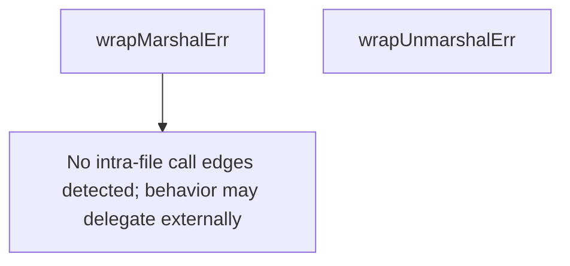

# Behavior Atom: quic/v3/datagram_errors.go

## Source Anchor

- Go source: [cloudflare/cloudflared@2026.3.0/quic/v3/datagram_errors.go](https://github.com/cloudflare/cloudflared/blob/2026.3.0/quic/v3/datagram_errors.go)
- Package: v3
- Module group: quic

## Behavioral Responsibility

Transport/protocol behavior for edge-origin data and control flows.

## Entry Points

- No exported/main/init entry point detected; behavior is internal support logic.

## Internal Function Surface

- wrapMarshalErr(err error) error (line 22)
- wrapUnmarshalErr(err error) error (line 26)

## Input Contract

- func-param:err error

## Output Contract

- return:error

## Side Effects and State Transitions

- No high-signal side effect pattern detected in static scan.

## Branching and Failure Semantics

- Branch density: if=0, switch=0, select=0
- error-return paths

## Import and Dependency Surface

- errors
- fmt

## Go-Impl Flow (Intra-file)

## Rust Porting Notes

- **Error wrapping**: `wrapMarshalErr()` / `wrapUnmarshalErr()` add context to errors → use `thiserror` derive with `#[error("marshal datagram: {0}")]` or `anyhow::Context` for ad-hoc wrapping.
- **Quirk — trivial file**: Two pure functions with zero branching; may fold into the parent `datagram.rs` module as inline helpers or `From` impls on the error enum.

## Accuracy Notes

- Generated from Go AST parsing and source text pattern extraction.
- Source link is authoritative for disputed semantics; keep this atom synchronized with the linked file.
