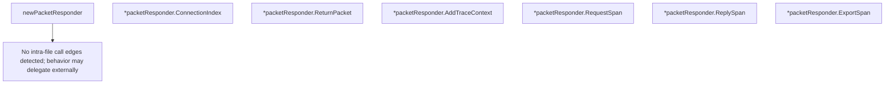

# Behavior Atom: quic/v3/icmp.go

## Source Anchor

- Go source: [cloudflare/cloudflared@2026.3.0/quic/v3/icmp.go](https://github.com/cloudflare/cloudflared/blob/2026.3.0/quic/v3/icmp.go)
- Package: v3
- Module group: quic

## Behavioral Responsibility

Transport/protocol behavior for edge-origin data and control flows.

## Entry Points

- (*packetResponder) ConnectionIndex() uint8 (line 28)
- (*packetResponder) ReturnPacket(pk*packet.ICMP) error (line 32)
- (*packetResponder) AddTraceContext(tracedCtx*tracing.TracedContext, serializedIdentity []byte) (line 36)
- (*packetResponder) RequestSpan(ctx context.Context, pk*packet.ICMP) (context.Context, trace.Span) (line 40)
- (*packetResponder) ReplySpan(ctx context.Context, logger*zerolog.Logger) (context.Context, trace.Span) (line 45)
- (*packetResponder) ExportSpan() (line 50)

## Internal Function Surface

- newPacketResponder(datagramMuxer DatagramICMPWriter, connID uint8) ingress.ICMPResponder (line 21)

## Input Contract

- func-param:connID uint8
- func-param:ctx context.Context
- func-param:datagramMuxer DatagramICMPWriter
- func-param:logger *zerolog.Logger
- func-param:pk *packet.ICMP
- func-param:serializedIdentity []byte
- func-param:tracedCtx *tracing.TracedContext

## Output Contract

- return:context.Context
- return:error
- return:ingress.ICMPResponder
- return:trace.Span
- return:uint8
- stdout/stderr or structured logs

## Side Effects and State Transitions

- No high-signal side effect pattern detected in static scan.

## Branching and Failure Semantics

- Branch density: if=0, switch=0, select=0
- No explicit failure pattern markers found in static scan.

## Import and Dependency Surface

- context
- github.com/cloudflare/cloudflared/ingress
- github.com/cloudflare/cloudflared/packet
- github.com/cloudflare/cloudflared/tracing
- github.com/rs/zerolog
- go.opentelemetry.io/otel/trace

## Go-Impl Flow (Intra-file)

## Rust Porting Notes

- **ICMPResponder interface**: `packetResponder` implements `ingress.ICMPResponder` → implement an `IcmpResponder` trait with `async fn return_packet(&self, packet: &[u8]) -> Result<()>`.
- **OpenTelemetry tracing**: `go.opentelemetry.io/otel/trace` span creation → `tracing::Span` with `tracing-opentelemetry` bridge; `AddTraceContext`, `RequestSpan`, `ReplySpan`, `ExportSpan` become methods returning `tracing::Span` or `opentelemetry::trace::Span`.
- **Connection index**: `ConnectionIndex()` returns an integer identifier → newtype `ConnIndex(u8)` for type safety.
- **Quirk — zero branching**: All methods are straight-line call-throughs; the Rust port should be equally simple with no conditional logic.

## Accuracy Notes

- Generated from Go AST parsing and source text pattern extraction.
- Source link is authoritative for disputed semantics; keep this atom synchronized with the linked file.
