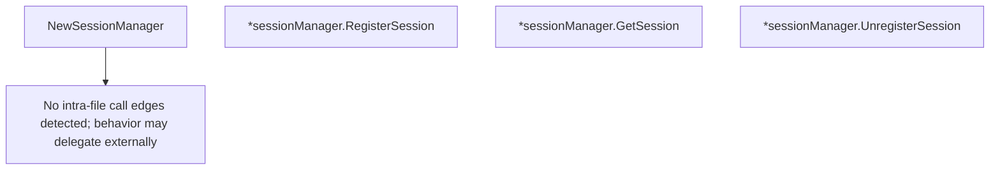

# Behavior Atom: quic/v3/manager.go

## Source Anchor

- Go source: [cloudflare/cloudflared@2026.3.0/quic/v3/manager.go](https://github.com/cloudflare/cloudflared/blob/2026.3.0/quic/v3/manager.go)
- Package: v3
- Module group: quic

## Behavioral Responsibility

Transport/protocol behavior for edge-origin data and control flows.

## Entry Points

- NewSessionManager(metrics Metrics, log *zerolog.Logger, originDialer ingress.OriginUDPDialer, limiter cfdflow.Limiter) SessionManager (line 49)
- (*sessionManager) RegisterSession(request*UDPSessionRegistrationDatagram, conn DatagramConn) (Session, error) (line 59)
- (*sessionManager) GetSession(requestID RequestID) (Session, error) (line 94)
- (*sessionManager) UnregisterSession(requestID RequestID) (line 104)

## Internal Function Surface

- None detected.

## Input Contract

- func-param:conn DatagramConn
- func-param:limiter cfdflow.Limiter
- func-param:log *zerolog.Logger
- func-param:metrics Metrics
- func-param:originDialer ingress.OriginUDPDialer
- func-param:request *UDPSessionRegistrationDatagram
- func-param:requestID RequestID

## Output Contract

- return:Session
- return:SessionManager
- return:error
- stdout/stderr or structured logs

## Side Effects and State Transitions

- network I/O
- concurrency primitives

## Branching and Failure Semantics

- Branch density: if=6, switch=0, select=0
- error-return paths

## Import and Dependency Surface

- errors
- github.com/cloudflare/cloudflared/flow
- github.com/cloudflare/cloudflared/ingress
- github.com/cloudflare/cloudflared/management
- github.com/rs/zerolog
- sync

## Go-Impl Flow (Intra-file)

## Accuracy Notes

- Generated from Go AST parsing and source text pattern extraction.
- Source link is authoritative for disputed semantics; keep this atom synchronized with the linked file.

## Rust Porting Notes

- **Session registry**: `sync.Mutex`-guarded `map[RequestID]*session` → `DashMap<RequestID, Arc<Session>>` or `tokio::sync::RwLock<HashMap<RequestID, SessionHandle>>`.
- **Origin dialer**: `ingress.OriginUDPDialer` for origin socket creation → async trait `OriginDialer { async fn dial(&self, addr: SocketAddr) -> io::Result<UdpSocket> }`.
- **Flow limiter**: `cfdflow.Limiter` interface → `Arc<dyn FlowLimiter>` with `try_acquire()` returning a guard type.
- **Session lifecycle**: `RegisterSession` creates session + dials origin → use RAII pattern: `SessionGuard` that unregisters on `Drop`.
- **Management events**: Session lifecycle events sent to `management.EventSink` → `tokio::sync::mpsc::Sender<SessionEvent>`.
- **Quirk — 6 if-branches**: Validation in `RegisterSession` for duplicate detection and flow limiting — use early returns with `?` operator.
