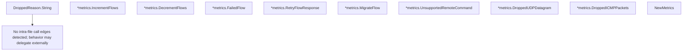

# Behavior Atom: quic/v3/metrics.go

## Source Anchor

- Go source: [cloudflare/cloudflared@2026.3.0/quic/v3/metrics.go](https://github.com/cloudflare/cloudflared/blob/2026.3.0/quic/v3/metrics.go)
- Package: v3
- Module group: quic

## Behavioral Responsibility

Transport/protocol behavior for edge-origin data and control flows.

## Entry Points

- (DroppedReason) String() string (line 41)
- (*metrics) IncrementFlows(connIndex uint8) (line 67)
- (*metrics) DecrementFlows(connIndex uint8) (line 72)
- (*metrics) FailedFlow(connIndex uint8) (line 76)
- (*metrics) RetryFlowResponse(connIndex uint8) (line 80)
- (*metrics) MigrateFlow(connIndex uint8) (line 84)
- (*metrics) UnsupportedRemoteCommand(connIndex uint8, command string) (line 88)
- (*metrics) DroppedUDPDatagram(connIndex uint8, reason DroppedReason) (line 92)
- (*metrics) DroppedICMPPackets(connIndex uint8, reason DroppedReason) (line 96)
- NewMetrics(registerer prometheus.Registerer) Metrics (line 100)

## Internal Function Surface

- None detected.

## Input Contract

- func-param:command string
- func-param:connIndex uint8
- func-param:reason DroppedReason
- func-param:registerer prometheus.Registerer

## Output Contract

- metrics emission
- return:Metrics
- return:string

## Side Effects and State Transitions

- subprocess execution

## Branching and Failure Semantics

- Branch density: if=0, switch=0, select=0
- No explicit failure pattern markers found in static scan.

## Import and Dependency Surface

- fmt
- github.com/cloudflare/cloudflared/quic
- github.com/prometheus/client_golang/prometheus

## Go-Impl Flow (Intra-file)

## Accuracy Notes

- Generated from Go AST parsing and source text pattern extraction.
- Source link is authoritative for disputed semantics; keep this atom synchronized with the linked file.

## Rust Porting Notes

- **Metrics trait**: `Metrics` interface with increment/decrement/fail methods → Rust trait `Metrics: Send + Sync` with methods for each counter operation.
- **DroppedReason enum**: Go iota enum with `String()` → `#[derive(strum::Display)]` Rust enum for label generation.
- **Prometheus vectors**: `prometheus.CounterVec`/`GaugeVec` with connection index label → `prometheus::IntCounterVec` or `metrics::counter!` with `conn_index` label.
- **Registration pattern**: `NewMetrics` registers all collectors → accept a `prometheus::Registry` parameter for testable metric isolation.
- **Zero branching**: Pure metrics boilerplate; keep the Rust port equally thin.
