# Behavior Atom: quic/v3/muxer.go

## Source Anchor

- Go source: [cloudflare/cloudflared@2026.3.0/quic/v3/muxer.go](https://github.com/cloudflare/cloudflared/blob/2026.3.0/quic/v3/muxer.go)
- Package: v3
- Module group: quic

## Behavioral Responsibility

Transport/protocol behavior for edge-origin data and control flows.

## Entry Points

- NewDatagramConn(conn QuicConnection, sessionManager SessionManager, icmpRouter ingress.ICMPRouter, index uint8, metrics Metrics, logger *zerolog.Logger) DatagramConn (line 79)
- (*datagramConn) ID() uint8 (line 104)
- (*datagramConn) SendUDPSessionDatagram(datagram []byte) error (line 108)
- (*datagramConn) SendUDPSessionResponse(id RequestID, resp SessionRegistrationResp) error (line 112)
- (*datagramConn) SendICMPPacket(icmp*packet.ICMP) error (line 124)
- (*datagramConn) SendICMPTTLExceed(icmp*packet.ICMP, rawPacket packet.RawPacket) error (line 147)
- (*datagramConn) Serve(ctx context.Context) error (line 169)

## Internal Function Surface

- (*datagramConn) pollDatagrams(ctx context.Context) (line 152)
- (*datagramConn) handleSessionRegistrationDatagram(ctx context.Context, datagram*UDPSessionRegistrationDatagram, logger *zerolog.Logger) (line 249)
- (*datagramConn) handleSessionAlreadyRegistered(requestID RequestID, logger*zerolog.Logger) (line 307)
- (*datagramConn) handleSessionMigration(requestID RequestID, logger*zerolog.Logger) (line 328)
- (*datagramConn) handleSessionRegistrationFailure(requestID RequestID, logger*zerolog.Logger) (line 350)
- (*datagramConn) handleSessionRegistrationRateLimited(datagram*UDPSessionRegistrationDatagram, logger *zerolog.Logger) (line 357)
- (*datagramConn) handleSessionPayloadDatagram(datagram*UDPSessionPayloadDatagram, logger *zerolog.Logger) (line 368)
- (*datagramConn) handleICMPPacket(datagram*ICMPDatagram) (line 379)
- (*datagramConn) processICMPDatagrams(ctx context.Context) (line 394)
- (*datagramConn) writeICMPPacket(datagram*ICMPDatagram) (line 411)

## Input Contract

- func-param:conn QuicConnection
- func-param:ctx context.Context
- func-param:datagram *ICMPDatagram
- func-param:datagram *UDPSessionPayloadDatagram
- func-param:datagram *UDPSessionRegistrationDatagram
- func-param:datagram []byte
- func-param:icmp *packet.ICMP
- func-param:icmpRouter ingress.ICMPRouter
- func-param:id RequestID
- func-param:index uint8
- func-param:logger *zerolog.Logger
- func-param:metrics Metrics
- func-param:rawPacket packet.RawPacket
- func-param:requestID RequestID
- func-param:resp SessionRegistrationResp
- func-param:sessionManager SessionManager

## Output Contract

- HTTP response writes
- metrics emission
- return:DatagramConn
- return:error
- return:uint8
- stdout/stderr or structured logs

## Side Effects and State Transitions

- network I/O
- concurrency primitives

## Branching and Failure Semantics

- Branch density: if=28, switch=2, select=3
- error-return paths
- fallback/default branches

## Import and Dependency Surface

- context
- errors
- fmt
- github.com/cloudflare/cloudflared/ingress
- github.com/cloudflare/cloudflared/packet
- github.com/rs/zerolog
- sync
- time

## Go-Impl Flow (Intra-file)

```mermaid
flowchart TD
    F1["NewDatagramConn"]
    F2["*datagramConn.ID"]
    F3["*datagramConn.SendUDPSessionDatagram"]
    F4["*datagramConn.SendUDPSessionResponse"]
    F5["*datagramConn.SendICMPPacket"]
    F6["*datagramConn.SendICMPTTLExceed"]
    F7["*datagramConn.pollDatagrams"]
    F8["*datagramConn.Serve"]
    F9["*datagramConn.handleSessionRegistrationDatagram"]
    F10["*datagramConn.handleSessionAlreadyRegistered"]
    F11["*datagramConn.handleSessionMigration"]
    F12["*datagramConn.handleSessionRegistrationFailure"]
    F13["*datagramConn.handleSessionRegistrationRateLimited"]
    F14["*datagramConn.handleSessionPayloadDatagram"]
    F15["*datagramConn.handleICMPPacket"]
    F16["*datagramConn.processICMPDatagrams"]
    F17["*datagramConn.writeICMPPacket"]
    NOTE["No intra-file call edges detected; behavior may delegate externally"]
    F1 --> NOTE
```

## Accuracy Notes

- Generated from Go AST parsing and source text pattern extraction.
- Source link is authoritative for disputed semantics; keep this atom synchronized with the linked file.

## Rust Porting Notes

- **Datagram framing**: Binary datagram type/payload encoding → `bytes::Buf`/`bytes::BufMut` for zero-copy parsing; define a `DatagramFrame` enum with `encode`/`decode` methods.
- **Session dispatch**: Datagram routing by session ID → `HashMap<RequestID, SessionHandle>` behind `tokio::sync::RwLock` or `DashMap`.
- **ICMP forwarding**: `ingress.ICMPRouter` packet dispatch → async trait with `send_icmp`/`recv_icmp` methods.
- **Select loop**: 3 `select` statements for datagram reception and session lifecycle → `tokio::select!` with biased polling for datagram priority.
- **Mutex guarding**: `sync.Mutex` for session map → `tokio::sync::Mutex` or `DashMap` for concurrent session registration.
- **Quirk — 28 if-branches**: Dense conditional logic for datagram type classification and error handling — model as `match` on a `DatagramType` enum derived from the first byte.
- **Quirk — send methods split by type**: Separate `SendUDPSessionDatagram`/`SendICMPPacket`/`SendICMPTTLExceed` — unify under an enum-dispatched `send_datagram` method in Rust to reduce API surface.
