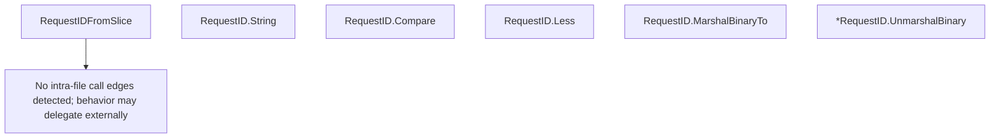

# Behavior Atom: quic/v3/request.go

## Source Anchor

- Go source: [cloudflare/cloudflared@2026.3.0/quic/v3/request.go](https://github.com/cloudflare/cloudflared/blob/2026.3.0/quic/v3/request.go)
- Package: v3
- Module group: quic

## Behavioral Responsibility

Transport/protocol behavior for edge-origin data and control flows.

## Entry Points

- RequestIDFromSlice(data []byte) (RequestID, error) (line 30)
- (RequestID) String() string (line 41)
- (RequestID) Compare(id2 RequestID) int (line 48)
- (RequestID) Less(id2 RequestID) bool (line 67)
- (RequestID) MarshalBinaryTo(data []byte) error (line 70)
- (*RequestID) UnmarshalBinary(data []byte) error (line 79)

## Internal Function Surface

- None detected.

## Input Contract

- func-param:data []byte
- func-param:id2 RequestID

## Output Contract

- return:RequestID
- return:bool
- return:error
- return:int
- return:string

## Side Effects and State Transitions

- No high-signal side effect pattern detected in static scan.

## Branching and Failure Semantics

- Branch density: if=7, switch=0, select=0
- No explicit failure pattern markers found in static scan.

## Import and Dependency Surface

- encoding/binary
- errors
- fmt

## Go-Impl Flow (Intra-file)

## Rust Porting Notes

- **RequestID type**: 16-byte binary-serializable identity type → `#[derive(Clone, Copy, PartialEq, Eq, PartialOrd, Ord, Hash)] struct RequestId([u8; 16])` with manual `Display` impl.
- **Binary codec**: `MarshalBinaryTo()` / `UnmarshalBinary()` → `impl RequestId { fn from_bytes(b: &[u8]) -> Result<Self, ParseError>; fn to_bytes(&self) -> [u8; 16]; }`.
- **Comparison methods**: `Compare()` and `Less()` → derive `Ord` for automatic comparison; `Display` for string output.
- **RequestIDFromSlice**: Validates slice length before copy → `TryFrom<&[u8]>` impl with length check returning `Result`.
- **Quirk — 7 if-branches**: Length validation guards; in Rust, use `<[u8]>::try_into()` which handles the length check automatically for fixed-size arrays.

## Accuracy Notes

- Generated from Go AST parsing and source text pattern extraction.
- Source link is authoritative for disputed semantics; keep this atom synchronized with the linked file.
