# Behavior Atom: quic/v3/session.go

## Source Anchor

- Go source: [cloudflare/cloudflared@2026.3.0/quic/v3/session.go](https://github.com/cloudflare/cloudflared/blob/2026.3.0/quic/v3/session.go)
- Package: v3
- Module group: quic

## Behavioral Responsibility

Transport/protocol behavior for edge-origin data and control flows.

## Entry Points

- (SessionIdleErr) Error() string (line 44)
- (SessionIdleErr) Is(target error) bool (line 48)
- NewSession(id RequestID, closeAfterIdle time.Duration, origin io.ReadWriteCloser, originAddr net.Addr, localAddr net.Addr, eyeball DatagramConn, metrics Metrics, log *zerolog.Logger) Session (line 94)
- (*session) ID() RequestID (line 144)
- (*session) RemoteAddr() net.Addr (line 148)
- (*session) LocalAddr() net.Addr (line 152)
- (*session) ConnectionID() uint8 (line 156)
- (*session) Migrate(eyeball DatagramConn, ctx context.Context, logger*zerolog.Logger) (line 161)
- (*session) Serve(ctx context.Context) error (line 176)
- (*session) Write(payload []byte) (line 226)
- (*session) ResetIdleTimer() (line 292)
- (*session) Close() error (line 305)

## Internal Function Surface

- newSessionIdleErr(timeout time.Duration) error (line 53)
- (*session) readLoop() (line 183)
- (*session) writeLoop() (line 236)
- isConnectionClosed(err error) bool (line 272)
- (*session) closeSession(err error) (line 278)
- (*session) markActive() (line 298)
- (*session) waitForCloseCondition(ctx context.Context, closeAfterIdle time.Duration) error (line 310)

## Input Contract

- func-param:closeAfterIdle time.Duration
- func-param:ctx context.Context
- func-param:err error
- func-param:eyeball DatagramConn
- func-param:id RequestID
- func-param:localAddr net.Addr
- func-param:log *zerolog.Logger
- func-param:logger *zerolog.Logger
- func-param:metrics Metrics
- func-param:origin io.ReadWriteCloser
- func-param:originAddr net.Addr
- func-param:payload []byte
- func-param:target error
- func-param:timeout time.Duration

## Output Contract

- HTTP response writes
- metrics emission
- return:RequestID
- return:Session
- return:bool
- return:error
- return:net.Addr
- return:string
- return:uint8
- stdout/stderr or structured logs

## Side Effects and State Transitions

- network I/O
- concurrency primitives
- timers and scheduling

## Branching and Failure Semantics

- Branch density: if=12, switch=0, select=6
- error-return paths
- fallback/default branches

## Import and Dependency Surface

- context
- errors
- fmt
- github.com/rs/zerolog
- io
- net
- os
- sync
- sync/atomic
- time

## Go-Impl Flow (Intra-file)

```mermaid
flowchart TD
    F1["SessionIdleErr.Error"]
    F2["SessionIdleErr.Is"]
    F3["newSessionIdleErr"]
    F4["NewSession"]
    F5["*session.ID"]
    F6["*session.RemoteAddr"]
    F7["*session.LocalAddr"]
    F8["*session.ConnectionID"]
    F9["*session.Migrate"]
    F10["*session.Serve"]
    F11["*session.readLoop"]
    F12["*session.Write"]
    F13["*session.writeLoop"]
    F14["isConnectionClosed"]
    F15["*session.closeSession"]
    F16["*session.ResetIdleTimer"]
    F17["*session.markActive"]
    F18["*session.Close"]
    F19["*session.waitForCloseCondition"]
    F11 --> F14
    F13 --> F14
    F19 --> F3
```

## Accuracy Notes

- Generated from Go AST parsing and source text pattern extraction.
- Source link is authoritative for disputed semantics; keep this atom synchronized with the linked file.

## Rust Porting Notes

- **Origin stream**: `io.ReadWriteCloser` → `tokio::io::AsyncRead + AsyncWrite` trait object or generic bound.
- **Read/write loops**: Two goroutines (`readLoop`, `writeLoop`) → `tokio::spawn` tasks managed via `JoinSet` or `tokio::select!` in a single `Serve` future.
- **Atomic activity tracking**: `sync/atomic` int64 for last-active timestamp → `std::sync::atomic::AtomicI64` with `Ordering::Relaxed`.
- **Idle timer**: `time.Timer` reset pattern → `tokio::time::Sleep` wrapped in `Pin<Box<Sleep>>` and reset via `sleep.as_mut().reset()`.
- **Close-once**: `sync.Once` for session teardown → `std::sync::Once` or `tokio::sync::OnceCell`; prefer `Drop` impl combined with a `closed` `AtomicBool` flag.
- **Datagram interface**: `DatagramConn` Go interface → Rust async trait with `async fn send_datagram(&self, payload: &[u8])` and `async fn recv_datagram(&self) -> Bytes`.
- **Session migration**: `Migrate` swaps the eyeball connection → `Arc<Mutex<DatagramConn>>` or atomic swap pattern to hand off during QUIC migration.
- **Quirk — 6 select statements**: Heavy `select` usage for close/idle/context coordination → consolidate into fewer `tokio::select!` blocks; consider a single event loop with an enum of possible wakeup sources.
- **Quirk — SessionIdleErr sentinel**: Custom error type with `Is(target)` method → implement `PartialEq` or use `matches!` for error matching in Rust.
