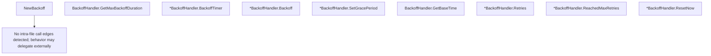

# Behavior Atom: retry/backoffhandler.go

## Source Anchor

- Go source: [cloudflare/cloudflared@2026.3.0/retry/backoffhandler.go](https://github.com/cloudflare/cloudflared/blob/2026.3.0/retry/backoffhandler.go)
- Package: retry
- Module group: retry

## Behavioral Responsibility

Core package behavior anchored to this source file.

## Entry Points

- NewBackoff(maxRetries uint, baseTime time.Duration, retryForever bool) BackoffHandler (line 40)
- (BackoffHandler) GetMaxBackoffDuration(ctx context.Context) (time.Duration, bool) (line 49)
- (*BackoffHandler) BackoffTimer() <-chan time.Time (line 70)
- (*BackoffHandler) Backoff(ctx context.Context) bool (line 89)
- (*BackoffHandler) SetGracePeriod() time.Duration (line 104)
- (BackoffHandler) GetBaseTime() time.Duration (line 112)
- (*BackoffHandler) Retries() int (line 120)
- (*BackoffHandler) ReachedMaxRetries() bool (line 124)
- (*BackoffHandler) ResetNow() (line 128)

## Internal Function Surface

- None detected.

## Input Contract

- func-param:baseTime time.Duration
- func-param:ctx context.Context
- func-param:maxRetries uint
- func-param:retryForever bool

## Output Contract

- return:<-chan time.Time
- return:BackoffHandler
- return:bool
- return:int
- return:time.Duration

## Side Effects and State Transitions

- timers and scheduling

## Branching and Failure Semantics

- Branch density: if=7, switch=0, select=2
- fallback/default branches

## Import and Dependency Surface

- context
- math/rand
- time

## Go-Impl Flow (Intra-file)

## Accuracy Notes

- Generated from Go AST parsing and source text pattern extraction.
- Source link is authoritative for disputed semantics; keep this atom synchronized with the linked file.

## Rust Porting Notes

- **Backoff algorithm**: Exponential backoff with jitter → `backon` crate or manual implementation using `tokio::time::sleep` with `Duration::from_secs(base * 2^retries) + jitter`.
- **Timer channel**: `BackoffTimer() <-chan time.Time` → async `fn backoff_sleep(&mut self) -> tokio::time::Sleep` or return a `Pin<Box<Sleep>>` future.
- **Context cancellation**: `Backoff(ctx)` respects cancellation → `tokio::select!` on the sleep future and cancellation token.
- **Grace period**: `SetGracePeriod` derives grace from current backoff → store as `Option<Instant>` and check `elapsed()` before allowing retry.
- **Random jitter**: `math/rand` for jitter → `rand::thread_rng().gen_range(0..=max_jitter)` using `rand` crate.
- **Quirk — select with 2 cases**: Both selects guard against context done vs timer → idiomatic `tokio::select!` pattern.
- **Quirk — retryForever flag**: When true, `ReachedMaxRetries` always returns false — model as `enum RetryPolicy { MaxRetries(u32), Forever }` for explicit intent.
