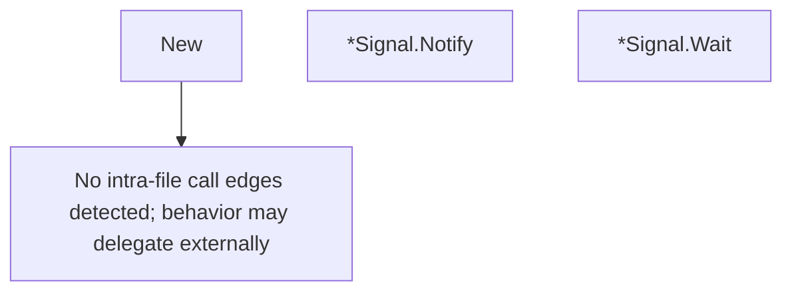

# Behavior Atom: signal/safe_signal.go

## Source Anchor

- Go source: [cloudflare/cloudflared@2026.3.0/signal/safe_signal.go](https://github.com/cloudflare/cloudflared/blob/2026.3.0/signal/safe_signal.go)
- Package: signal
- Module group: signal

## Behavioral Responsibility

Runtime lifecycle and orchestration behavior.

## Entry Points

- New(ch chan struct{}) *Signal (line 14)
- (*Signal) Notify() (line 23)
- (*Signal) Wait() <-chan struct{} (line 31)

## Internal Function Surface

- None detected.

## Input Contract

- func-param:ch chan struct{}

## Output Contract

- return:*Signal
- return:<-chan struct{}

## Side Effects and State Transitions

- concurrency primitives

## Branching and Failure Semantics

- Branch density: if=0, switch=0, select=0
- No explicit failure pattern markers found in static scan.

## Import and Dependency Surface

- sync

## Go-Impl Flow (Intra-file)

## Rust Porting Notes

- **sync.Once channel signal**: `sync.Once` guarding `close(chan struct{})` → `tokio::sync::Notify` or `tokio::sync::oneshot` for one-shot signaling.
- **Quirk — zero branching**: Pure concurrency primitive; direct mapping.

## Accuracy Notes

- Generated from Go AST parsing and source text pattern extraction.
- Source link is authoritative for disputed semantics; keep this atom synchronized with the linked file.
