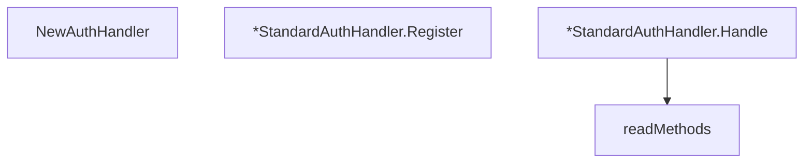

# Behavior Atom: socks/auth_handler.go

## Source Anchor

- Go source: [cloudflare/cloudflared@2026.3.0/socks/auth_handler.go](https://github.com/cloudflare/cloudflared/blob/2026.3.0/socks/auth_handler.go)
- Package: socks
- Module group: socks

## Behavioral Responsibility

Core package behavior anchored to this source file.

## Entry Points

- NewAuthHandler() AuthHandler (line 33)
- (*StandardAuthHandler) Register(method uint8, a Authenticator) (line 42)
- (*StandardAuthHandler) Handle(bufConn io.Reader, conn io.Writer) error (line 47)

## Internal Function Surface

- readMethods(r io.Reader) ([]byte, error) (line 67)

## Input Contract

- func-param:a Authenticator
- func-param:bufConn io.Reader
- func-param:conn io.Writer
- func-param:method uint8
- func-param:r io.Reader

## Output Contract

- HTTP response writes
- return:AuthHandler
- return:[]byte
- return:error

## Side Effects and State Transitions

- No high-signal side effect pattern detected in static scan.

## Branching and Failure Semantics

- Branch density: if=3, switch=0, select=0
- error-return paths

## Import and Dependency Surface

- fmt
- io

## Go-Impl Flow (Intra-file)

## Rust Porting Notes

- **Method-map dispatch**: Auth method byte → `Authenticator` lookup → `HashMap<u8, Box<dyn Authenticator>>` or `match method_byte { … }`.
- **Quirk — 3 if-branches**: Method negotiation; straightforward `match`.

## Accuracy Notes

- Generated from Go AST parsing and source text pattern extraction.
- Source link is authoritative for disputed semantics; keep this atom synchronized with the linked file.
