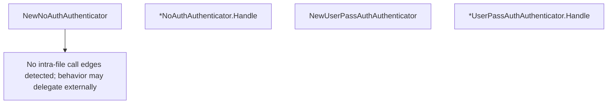

# Behavior Atom: socks/authenticator.go

## Source Anchor

- Go source: [cloudflare/cloudflared@2026.3.0/socks/authenticator.go](https://github.com/cloudflare/cloudflared/blob/2026.3.0/socks/authenticator.go)
- Package: socks
- Module group: socks

## Behavioral Responsibility

Core package behavior anchored to this source file.

## Entry Points

- NewNoAuthAuthenticator() Authenticator (line 17)
- (*NoAuthAuthenticator) Handle(reader io.Reader, writer io.Writer) error (line 22)
- NewUserPassAuthAuthenticator(isValid func(string, string) bool) Authenticator (line 33)
- (*UserPassAuthAuthenticator) Handle(reader io.Reader, writer io.Writer) error (line 40)

## Internal Function Surface

- None detected.

## Input Contract

- func-param:isValid func(string, string) bool
- func-param:reader io.Reader
- func-param:writer io.Writer

## Output Contract

- HTTP response writes
- return:Authenticator
- return:error

## Side Effects and State Transitions

- No high-signal side effect pattern detected in static scan.

## Branching and Failure Semantics

- Branch density: if=8, switch=0, select=0
- error-return paths

## Import and Dependency Surface

- fmt
- io

## Go-Impl Flow (Intra-file)

## Rust Porting Notes

- **SOCKS5 auth protocol**: `io.Reader`/`io.Writer` based username/password exchange → `tokio::io::AsyncReadExt::read_exact()` + `AsyncWriteExt::write_all()` for SOCKS5 sub-negotiation.
- **Quirk — 8 if-branches**: Protocol validation checks; use `?` chain on each read/parse step.

## Accuracy Notes

- Generated from Go AST parsing and source text pattern extraction.
- Source link is authoritative for disputed semantics; keep this atom synchronized with the linked file.
