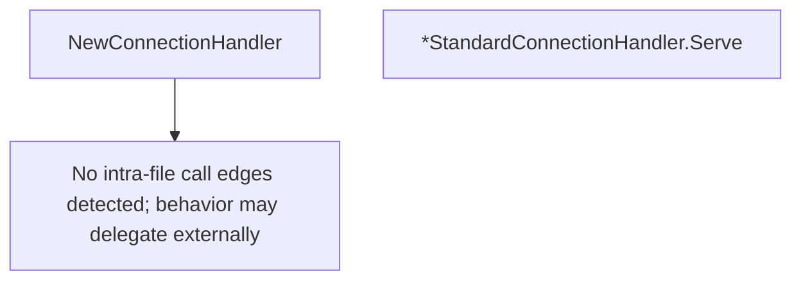

# Behavior Atom: socks/connection_handler.go

## Source Anchor

- Go source: [cloudflare/cloudflared@2026.3.0/socks/connection_handler.go](https://github.com/cloudflare/cloudflared/blob/2026.3.0/socks/connection_handler.go)
- Package: socks
- Module group: socks

## Behavioral Responsibility

Core package behavior anchored to this source file.

## Entry Points

- NewConnectionHandler(requestHandler RequestHandler) ConnectionHandler (line 23)
- (*StandardConnectionHandler) Serve(c io.ReadWriter) error (line 31)

## Internal Function Surface

- None detected.

## Input Contract

- func-param:c io.ReadWriter
- func-param:requestHandler RequestHandler

## Output Contract

- return:ConnectionHandler
- return:error

## Side Effects and State Transitions

- network I/O

## Branching and Failure Semantics

- Branch density: if=4, switch=0, select=0
- error-return paths

## Import and Dependency Surface

- bufio
- fmt
- io

## Go-Impl Flow (Intra-file)

## Rust Porting Notes

- **Handler composition**: Composes `AuthHandler` + `RequestHandler` → struct holding `Box<dyn AuthHandler>` + `Box<dyn RequestHandler>` or generic parameters.
- **bufio.Reader**: Buffered reader wrapping TCP conn → `tokio::io::BufReader::new(stream)`.
- **Quirk — 4 if-branches**: Sequential auth then request handling.

## Accuracy Notes

- Generated from Go AST parsing and source text pattern extraction.
- Source link is authoritative for disputed semantics; keep this atom synchronized with the linked file.
