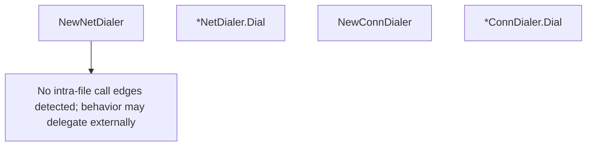

# Behavior Atom: socks/dialer.go

## Source Anchor

- Go source: [cloudflare/cloudflared@2026.3.0/socks/dialer.go](https://github.com/cloudflare/cloudflared/blob/2026.3.0/socks/dialer.go)
- Package: socks
- Module group: socks

## Behavioral Responsibility

Core package behavior anchored to this source file.

## Entry Points

- NewNetDialer() Dialer (line 19)
- (*NetDialer) Dial(address string) (io.ReadWriteCloser,*AddrSpec, error) (line 24)
- NewConnDialer(conn net.Conn) Dialer (line 42)
- (*ConnDialer) Dial(address string) (io.ReadWriteCloser,*AddrSpec, error) (line 49)

## Internal Function Surface

- None detected.

## Input Contract

- func-param:address string
- func-param:conn net.Conn

## Output Contract

- return:*AddrSpec
- return:Dialer
- return:error
- return:io.ReadWriteCloser

## Side Effects and State Transitions

- network I/O

## Branching and Failure Semantics

- Branch density: if=2, switch=0, select=0
- error-return paths

## Import and Dependency Surface

- fmt
- io
- net

## Go-Impl Flow (Intra-file)

## Rust Porting Notes

- **Dialer interface**: `net.Dial` abstraction → `trait Dialer: Send + Sync { async fn dial(&self, addr: &str) -> io::Result<TcpStream>; }`.
- **Quirk — 2 if-branches**: Minimal; direct translation.

## Accuracy Notes

- Generated from Go AST parsing and source text pattern extraction.
- Source link is authoritative for disputed semantics; keep this atom synchronized with the linked file.
