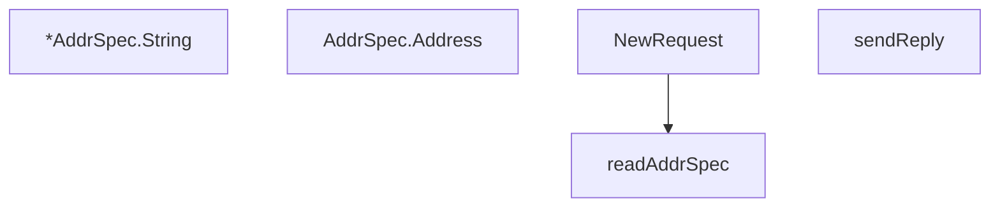

# Behavior Atom: socks/request.go

## Source Anchor

- Go source: [cloudflare/cloudflared@2026.3.0/socks/request.go](https://github.com/cloudflare/cloudflared/blob/2026.3.0/socks/request.go)
- Package: socks
- Module group: socks

## Behavioral Responsibility

Core package behavior anchored to this source file.

## Entry Points

- (*AddrSpec) String() string (line 46)
- (AddrSpec) Address() string (line 55)
- NewRequest(bufConn io.Reader) (*Request, error) (line 75)

## Internal Function Surface

- sendReply(w io.Writer, resp uint8, addr *AddrSpec) error (line 101)
- readAddrSpec(r io.Reader) (*AddrSpec, error) (line 147)

## Input Contract

- func-param:addr *AddrSpec
- func-param:bufConn io.Reader
- func-param:r io.Reader
- func-param:resp uint8
- func-param:w io.Writer

## Output Contract

- HTTP response writes
- return:*AddrSpec
- return:*Request
- return:error
- return:string

## Side Effects and State Transitions

- network I/O
- subprocess execution

## Branching and Failure Semantics

- Branch density: if=11, switch=2, select=0
- error-return paths
- fallback/default branches

## Import and Dependency Surface

- fmt
- io
- net
- strconv

## Go-Impl Flow (Intra-file)

## Rust Porting Notes

- **SOCKS5 binary parsing**: `io.Reader` for address type + port reading → `tokio::io::AsyncReadExt::read_u8()` / `read_u16()` with `byteorder` or `bytes::Buf`.
- **Address type dispatch**: IPv4/IPv6/domain switch → `match addr_type { 0x01 => Ipv4, 0x03 => Domain, 0x04 => Ipv6 }`.
- **Quirk — 11 if + 2 switch**: Protocol parsing validation; sequential `?` reads.

## Accuracy Notes

- Generated from Go AST parsing and source text pattern extraction.
- Source link is authoritative for disputed semantics; keep this atom synchronized with the linked file.
