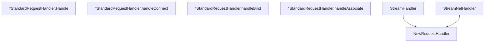

# Behavior Atom: socks/request_handler.go

## Source Anchor

- Go source: [cloudflare/cloudflared@2026.3.0/socks/request_handler.go](https://github.com/cloudflare/cloudflared/blob/2026.3.0/socks/request_handler.go)
- Package: socks
- Module group: socks

## Behavioral Responsibility

Core package behavior anchored to this source file.

## Entry Points

- NewRequestHandler(dialer Dialer, accessPolicy *ipaccess.Policy) RequestHandler (line 27)
- (*StandardRequestHandler) Handle(req*Request, conn io.ReadWriter) error (line 35)
- StreamHandler(tunnelConn io.ReadWriter, originConn net.Conn, log *zerolog.Logger) (line 134)
- StreamNetHandler(tunnelConn io.ReadWriter, accessPolicy *ipaccess.Policy, log*zerolog.Logger) (line 144)

## Internal Function Surface

- (*StandardRequestHandler) handleConnect(conn io.ReadWriter, req*Request) error (line 52)
- (*StandardRequestHandler) handleBind(conn io.ReadWriter, req*Request) error (line 118)
- (*StandardRequestHandler) handleAssociate(conn io.ReadWriter, req*Request) error (line 127)

## Input Contract

- func-param:accessPolicy *ipaccess.Policy
- func-param:conn io.ReadWriter
- func-param:dialer Dialer
- func-param:log *zerolog.Logger
- func-param:originConn net.Conn
- func-param:req *Request
- func-param:tunnelConn io.ReadWriter

## Output Contract

- return:RequestHandler
- return:error
- stdout/stderr or structured logs

## Side Effects and State Transitions

- network I/O
- subprocess execution
- concurrency primitives

## Branching and Failure Semantics

- Branch density: if=16, switch=1, select=0
- error-return paths
- fallback/default branches

## Import and Dependency Surface

- fmt
- github.com/cloudflare/cloudflared/ipaccess
- github.com/rs/zerolog
- io
- net
- strings

## Go-Impl Flow (Intra-file)

## Rust Porting Notes

- **Bidirectional stream copy**: Goroutine pair for CONNECT relay → `tokio::io::copy_bidirectional()` or `tokio::select!` with two `copy` futures.
- **SOCKS5 commands**: CONNECT/BIND/ASSOCIATE dispatch → `match command { Connect => …, Bind => …, Associate => … }`.
- **IP access policy**: `ipaccess.Policy` check before dialing → reuse Rust `IpAccessPolicy` module.
- **Quirk — 16 if + 1 switch**: Command dispatch + error handling; decompose per-command handlers.

## Accuracy Notes

- Generated from Go AST parsing and source text pattern extraction.
- Source link is authoritative for disputed semantics; keep this atom synchronized with the linked file.
