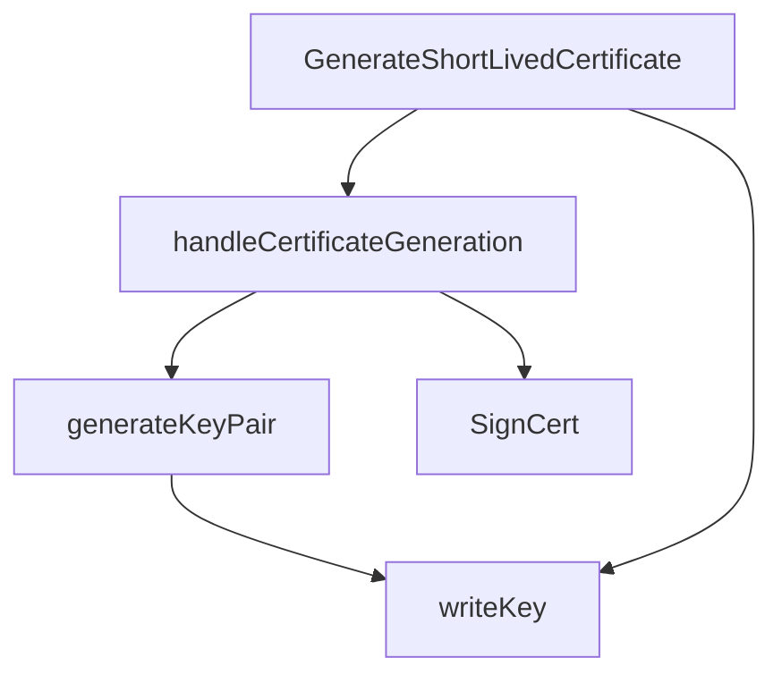

# Behavior Atom: sshgen/sshgen.go

## Source Anchor

- Go source: [cloudflare/cloudflared@2026.3.0/sshgen/sshgen.go](https://github.com/cloudflare/cloudflared/blob/2026.3.0/sshgen/sshgen.go)
- Package: sshgen
- Module group: sshgen

## Behavioral Responsibility

Core package behavior anchored to this source file.

## Entry Points

- GenerateShortLivedCertificate(appURL *url.URL, token string) error (line 58)
- SignCert(token string, pubKey string) (string, error) (line 88)

## Internal Function Surface

- handleCertificateGeneration(token string, fullName string) (string, error) (line 79)
- generateKeyPair(fullName string) ([]byte, error) (line 146)
- writeKey(filename string, data []byte) error (line 187)

## Input Contract

- func-param:appURL *url.URL
- func-param:data []byte
- func-param:filename string
- func-param:fullName string
- func-param:pubKey string
- func-param:token string

## Output Contract

- filesystem writes
- return:[]byte
- return:error
- return:string

## Side Effects and State Transitions

- network I/O
- filesystem I/O

## Branching and Failure Semantics

- Branch density: if=21, switch=0, select=0
- error-return paths

## Import and Dependency Surface

- bytes
- crypto/ecdsa
- crypto/elliptic
- crypto/rand
- crypto/x509
- encoding/json
- encoding/pem
- fmt
- github.com/cloudflare/cloudflared/config
- github.com/cloudflare/cloudflared/token
- github.com/go-jose/go-jose/v4
- github.com/go-jose/go-jose/v4/jwt
- github.com/mitchellh/go-homedir
- github.com/pkg/errors
- golang.org/x/crypto/ssh
- io
- net/http
- net/url
- os
- time

## Go-Impl Flow (Intra-file)

## Rust Porting Notes

- **Crypto key generation**: ECDSA P-256 + x509 cert + SSH public key → `p256` crate for ECDSA, `rcgen` for x509, `ssh-key` crate for SSH format.
- **JWT parsing**: `go-jose/v4` for short-lived token generation → `jsonwebtoken` crate.
- **PEM encoding**: `encoding/pem.Encode` → `pem::encode()`.
- **Home dir**: `go-homedir` → `dirs::home_dir()`.
- **Quirk — 21 if-branches**: Key gen + file write + HTTP call error paths; decompose into steps with `?`.

## Accuracy Notes

- Generated from Go AST parsing and source text pattern extraction.
- Source link is authoritative for disputed semantics; keep this atom synchronized with the linked file.
