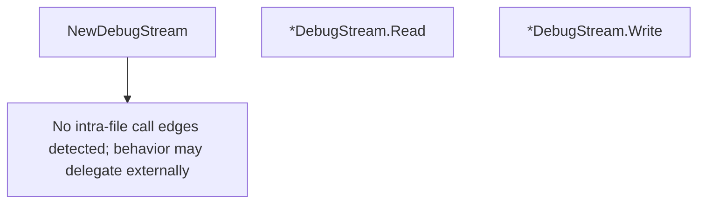

# Behavior Atom: stream/debug.go

## Source Anchor

- Go source: [cloudflare/cloudflared@2026.3.0/stream/debug.go](https://github.com/cloudflare/cloudflared/blob/2026.3.0/stream/debug.go)
- Package: stream
- Module group: stream

## Behavioral Responsibility

Transport/protocol behavior for edge-origin data and control flows.

## Entry Points

- NewDebugStream(stream io.ReadWriter, logger *zerolog.Logger, max uint64)*DebugStream (line 19)
- (*DebugStream) Read(p []byte) (n int, err error) (line 28)
- (*DebugStream) Write(p []byte) (n int, err error) (line 47)

## Internal Function Surface

- None detected.

## Input Contract

- func-param:logger *zerolog.Logger
- func-param:max uint64
- func-param:p []byte
- func-param:stream io.ReadWriter

## Output Contract

- HTTP response writes
- return:*DebugStream
- return:err error
- return:n int
- stdout/stderr or structured logs

## Side Effects and State Transitions

- concurrency primitives

## Branching and Failure Semantics

- Branch density: if=4, switch=0, select=0
- error-return paths

## Import and Dependency Surface

- github.com/rs/zerolog
- io
- sync/atomic

## Go-Impl Flow (Intra-file)

## Rust Porting Notes

- **Debug Read/Write wrapper**: `sync/atomic` counters for bytes read/written → `AtomicU64::fetch_add()` wrapping `AsyncRead`/`AsyncWrite` impl.
- **Quirk — 4 if-branches**: Conditional debug logging; use `tracing::trace!` with counter fields.

## Accuracy Notes

- Generated from Go AST parsing and source text pattern extraction.
- Source link is authoritative for disputed semantics; keep this atom synchronized with the linked file.
