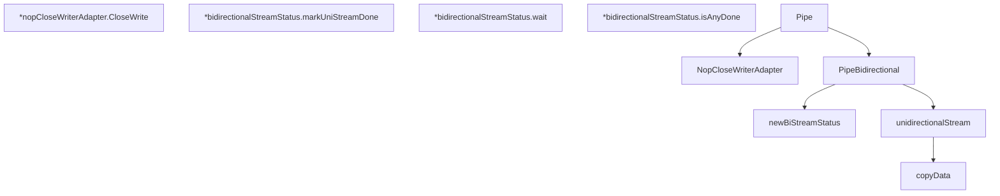

# Behavior Atom: stream/stream.go

## Source Anchor

- Go source: [cloudflare/cloudflared@2026.3.0/stream/stream.go](https://github.com/cloudflare/cloudflared/blob/2026.3.0/stream/stream.go)
- Package: stream
- Module group: stream

## Behavioral Responsibility

Transport/protocol behavior for edge-origin data and control flows.

## Entry Points

- NopCloseWriterAdapter(stream io.ReadWriter) *nopCloseWriterAdapter (line 40)
- (*nopCloseWriterAdapter) CloseWrite() error (line 44)
- Pipe(tunnelConn io.ReadWriter, originConn io.ReadWriter, log *zerolog.Logger) (line 89)
- PipeBidirectional(downstream Stream, upstream Stream, maxWaitForSecondStream time.Duration, log *zerolog.Logger) error (line 98)

## Internal Function Surface

- newBiStreamStatus() *bidirectionalStreamStatus (line 53)
- (*bidirectionalStreamStatus) markUniStreamDone() (line 60)
- (*bidirectionalStreamStatus) wait(maxWaitForSecondStream time.Duration) error (line 65)
- (*bidirectionalStreamStatus) isAnyDone() bool (line 84)
- unidirectionalStream(dst WriterCloser, src Reader, dir string, status *bidirectionalStreamStatus, log*zerolog.Logger) (line 111)
- copyData(dst io.Writer, src io.Reader, dir string) (written int64, err error) (line 144)

## Input Contract

- func-param:dir string
- func-param:downstream Stream
- func-param:dst WriterCloser
- func-param:dst io.Writer
- func-param:log *zerolog.Logger
- func-param:maxWaitForSecondStream time.Duration
- func-param:originConn io.ReadWriter
- func-param:src Reader
- func-param:src io.Reader
- func-param:status *bidirectionalStreamStatus
- func-param:stream io.ReadWriter
- func-param:tunnelConn io.ReadWriter
- func-param:upstream Stream

## Output Contract

- HTTP response writes
- return:*bidirectionalStreamStatus
- return:*nopCloseWriterAdapter
- return:bool
- return:err error
- return:error
- return:written int64
- stdout/stderr or structured logs

## Side Effects and State Transitions

- concurrency primitives
- timers and scheduling

## Branching and Failure Semantics

- Branch density: if=13, switch=0, select=1
- error-return paths

## Import and Dependency Surface

- encoding/hex
- fmt
- github.com/cloudflare/cloudflared/cfio
- github.com/getsentry/sentry-go
- github.com/pkg/errors
- github.com/rs/zerolog
- io
- runtime/debug
- sync/atomic
- time

## Go-Impl Flow (Intra-file)

## Accuracy Notes

- Generated from Go AST parsing and source text pattern extraction.
- Source link is authoritative for disputed semantics; keep this atom synchronized with the linked file.

## Rust Porting Notes

- **Bidirectional pipe**: `PipeBidirectional` with two goroutines copying in each direction → `tokio::io::copy_bidirectional` or manual `tokio::select!` on two `tokio::io::copy` futures.
- **Stream trait**: `Stream` interface with `Read`/`Write`/`CloseWrite` → Rust trait combining `AsyncRead + AsyncWrite` with an explicit `async fn close_write()` method.
- **Half-close coordination**: `maxWaitForSecondStream` timeout for graceful half-close → `tokio::time::timeout` wrapping the second copy direction after the first completes.
- **Atomic byte counters**: `sync/atomic` for transfer accounting → `std::sync::atomic::AtomicU64` for bytes transferred.
- **Sentry error reporting**: `sentry-go.CaptureException` on copy errors → `sentry::capture_error` or `tracing::error!` for structured error logging.
- **Panic recovery**: `runtime/debug.Stack()` in deferred panic handler → `std::panic::catch_unwind` if needed; in async code, panics in spawned tasks are captured by `JoinHandle`.
- **Quirk — NopCloseWriterAdapter**: Wraps `io.ReadWriter` to add no-op `CloseWrite` — in Rust, use a newtype with `impl AsyncWrite for NopCloseWriter<T>` where `shutdown` is a no-op.
- **Quirk — hex-encoded error context**: `encoding/hex` used for debug output of first bytes on error — use `hex` crate for equivalent `hex::encode` in error messages.
