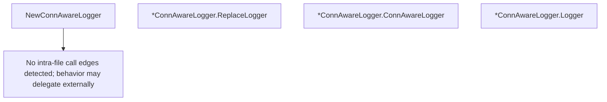

# Behavior Atom: supervisor/conn_aware_logger.go

## Source Anchor

- Go source: [cloudflare/cloudflared@2026.3.0/supervisor/conn_aware_logger.go](https://github.com/cloudflare/cloudflared/blob/2026.3.0/supervisor/conn_aware_logger.go)
- Package: supervisor
- Module group: supervisor

## Behavioral Responsibility

Runtime lifecycle and orchestration behavior.

## Entry Points

- NewConnAwareLogger(logger *zerolog.Logger, tracker*tunnelstate.ConnTracker, observer *connection.Observer)*ConnAwareLogger (line 15)
- (*ConnAwareLogger) ReplaceLogger(logger*zerolog.Logger) *ConnAwareLogger (line 26)
- (*ConnAwareLogger) ConnAwareLogger()*zerolog.Event (line 33)
- (*ConnAwareLogger) Logger()*zerolog.Logger (line 40)

## Internal Function Surface

- None detected.

## Input Contract

- func-param:logger *zerolog.Logger
- func-param:observer *connection.Observer
- func-param:tracker *tunnelstate.ConnTracker

## Output Contract

- return:*ConnAwareLogger
- return:*zerolog.Event
- return:*zerolog.Logger
- stdout/stderr or structured logs

## Side Effects and State Transitions

- No high-signal side effect pattern detected in static scan.

## Branching and Failure Semantics

- Branch density: if=1, switch=0, select=0
- No explicit failure pattern markers found in static scan.

## Import and Dependency Surface

- github.com/cloudflare/cloudflared/connection
- github.com/cloudflare/cloudflared/tunnelstate
- github.com/rs/zerolog

## Go-Impl Flow (Intra-file)

## Rust Porting Notes

- **Logger wrapper**: `ConnAwareLogger` wraps `zerolog.Logger` with connection state → in Rust, wrap `tracing::Span` or a `slog`-style logger struct carrying connection metadata as structured fields.
- **ReplaceLogger mutation**: Swaps the inner logger at runtime → use `Arc<RwLock<Logger>>` or `tracing::Span::entered()` re-entry; prefer immutable span-per-connection if possible.
- **Zerolog fluent API**: Method-chaining `.Str().Int().Msg()` → `tracing::info!(conn_id = %id, location = %loc, "message")` structured logging macros.
- **Quirk — minimal branching**: Only 1 if-branch; the Rust port should be a thin newtype wrapper around dynamic span/logger state.

## Accuracy Notes

- Generated from Go AST parsing and source text pattern extraction.
- Source link is authoritative for disputed semantics; keep this atom synchronized with the linked file.
