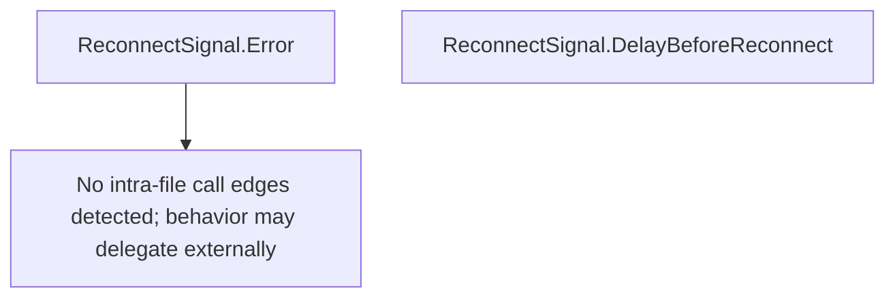

# Behavior Atom: supervisor/external_control.go

## Source Anchor

- Go source: [cloudflare/cloudflared@2026.3.0/supervisor/external_control.go](https://github.com/cloudflare/cloudflared/blob/2026.3.0/supervisor/external_control.go)
- Package: supervisor
- Module group: supervisor

## Behavioral Responsibility

Runtime lifecycle and orchestration behavior.

## Entry Points

- (ReconnectSignal) Error() string (line 13)
- (ReconnectSignal) DelayBeforeReconnect() (line 17)

## Internal Function Surface

- None detected.

## Input Contract

- Inputs are indirect through callers; no direct input pattern detected statically.

## Output Contract

- return:string

## Side Effects and State Transitions

- timers and scheduling

## Branching and Failure Semantics

- Branch density: if=1, switch=0, select=0
- No explicit failure pattern markers found in static scan.

## Import and Dependency Surface

- time

## Go-Impl Flow (Intra-file)

## Rust Porting Notes

- **ReconnectSignal type**: Implements `error` interface with `DelayBeforeReconnect()` duration method → in Rust, define `struct ReconnectSignal { delay: Duration }` implementing `std::error::Error` + `Display`, with a `delay()` accessor.
- **Duration semantics**: `time.Duration` → `std::time::Duration`; the delay value feeds into `tokio::time::sleep(duration)` at the caller.
- **Error-as-signal pattern**: Go uses an error return to signal reconnection → in Rust, prefer a typed `enum ControlAction { Reconnect(Duration), ... }` rather than encoding control flow in error types.

## Accuracy Notes

- Generated from Go AST parsing and source text pattern extraction.
- Source link is authoritative for disputed semantics; keep this atom synchronized with the linked file.
