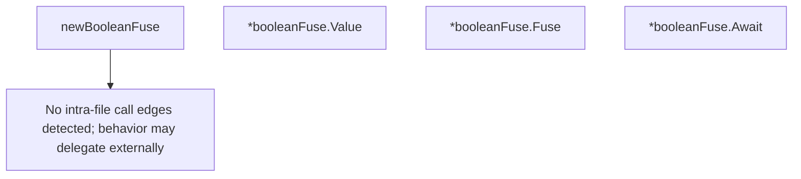

# Behavior Atom: supervisor/fuse.go

## Source Anchor

- Go source: [cloudflare/cloudflared@2026.3.0/supervisor/fuse.go](https://github.com/cloudflare/cloudflared/blob/2026.3.0/supervisor/fuse.go)
- Package: supervisor
- Module group: supervisor

## Behavioral Responsibility

Runtime lifecycle and orchestration behavior.

## Entry Points

- (*booleanFuse) Value() bool (line 20)
- (*booleanFuse) Fuse(result bool) (line 29)
- (*booleanFuse) Await() bool (line 43)

## Internal Function Surface

- newBooleanFuse() *booleanFuse (line 13)

## Input Contract

- func-param:result bool

## Output Contract

- return:*booleanFuse
- return:bool

## Side Effects and State Transitions

- concurrency primitives

## Branching and Failure Semantics

- Branch density: if=2, switch=0, select=0
- No explicit failure pattern markers found in static scan.

## Import and Dependency Surface

- sync

## Go-Impl Flow (Intra-file)

## Rust Porting Notes

- **One-shot latch**: `booleanFuse` with `sync.Once`-like semantics → `tokio::sync::Notify` (single waiter) or `tokio::sync::watch::channel(false)` where `Fuse()` sends `true`.
- **Blocking await**: `Await()` blocks the caller until the fuse fires → `notify.notified().await` or `watch_rx.changed().await` in async context.
- **Non-blocking read**: `Value()` returns current state without blocking → `watch_rx.borrow().clone()` or `AtomicBool::load(Ordering::Acquire)`.
- **Fuse-once guarantee**: `Fuse()` sets value exactly once → `std::sync::Once` for sync, or `watch::Sender::send_if_modified` for async.
- **Quirk — sync primitives**: The Go version uses `sync.Mutex` + `sync.Cond` (or `sync.Once`); in async Rust, prefer `tokio::sync` primitives to avoid blocking the executor.

## Accuracy Notes

- Generated from Go AST parsing and source text pattern extraction.
- Source link is authoritative for disputed semantics; keep this atom synchronized with the linked file.
