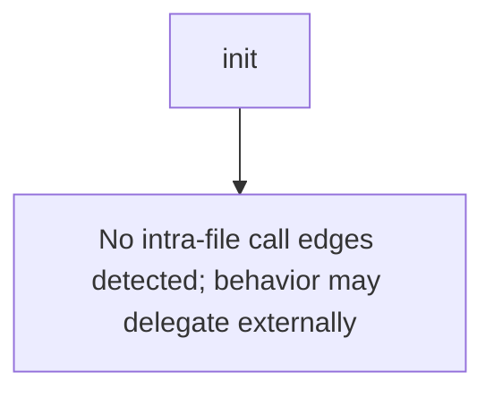

# Behavior Atom: supervisor/metrics.go

## Source Anchor

- Go source: [cloudflare/cloudflared@2026.3.0/supervisor/metrics.go](https://github.com/cloudflare/cloudflared/blob/2026.3.0/supervisor/metrics.go)
- Package: supervisor
- Module group: supervisor

## Behavioral Responsibility

Runtime lifecycle and orchestration behavior.

## Entry Points

- init() (line 23)

## Internal Function Surface

- None detected.

## Input Contract

- Inputs are indirect through callers; no direct input pattern detected statically.

## Output Contract

- metrics emission

## Side Effects and State Transitions

- No high-signal side effect pattern detected in static scan.

## Branching and Failure Semantics

- Branch density: if=0, switch=0, select=0
- No explicit failure pattern markers found in static scan.

## Import and Dependency Surface

- github.com/cloudflare/cloudflared/connection
- github.com/prometheus/client_golang/prometheus

## Go-Impl Flow (Intra-file)

## Rust Porting Notes

- **init() function**: Go `init()` auto-registers Prometheus metrics at package load → use `once_cell::sync::Lazy<SupervisorMetrics>` or register metrics explicitly during application startup.
- **Prometheus re-export**: Imports `connection` package metrics alongside supervisor-local metrics → in Rust, keep metric definitions in the supervisor module; cross-module metric sharing uses `Arc<MetricsRegistry>` or a shared `lazy_static!` registry.
- **Zero-logic file**: No branching; pure metric descriptor definitions → the Rust port should be a constants/statics module defining `IntCounter`, `Histogram`, etc.

## Accuracy Notes

- Generated from Go AST parsing and source text pattern extraction.
- Source link is authoritative for disputed semantics; keep this atom synchronized with the linked file.
