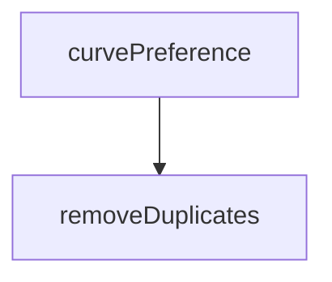

# Behavior Atom: supervisor/pqtunnels.go

## Source Anchor

- Go source: [cloudflare/cloudflared@2026.3.0/supervisor/pqtunnels.go](https://github.com/cloudflare/cloudflared/blob/2026.3.0/supervisor/pqtunnels.go)
- Package: supervisor
- Module group: supervisor

## Behavioral Responsibility

Runtime lifecycle and orchestration behavior.

## Entry Points

- No exported/main/init entry point detected; behavior is internal support logic.

## Internal Function Surface

- removeDuplicates(curves []tls.CurveID) []tls.CurveID (line 26)
- curvePreference(pqMode features.PostQuantumMode, fipsEnabled bool, currentCurve []tls.CurveID) ([]tls.CurveID, error) (line 38)

## Input Contract

- func-param:currentCurve []tls.CurveID
- func-param:curves []tls.CurveID
- func-param:fipsEnabled bool
- func-param:pqMode features.PostQuantumMode

## Output Contract

- return:[]tls.CurveID
- return:error

## Side Effects and State Transitions

- No high-signal side effect pattern detected in static scan.

## Branching and Failure Semantics

- Branch density: if=3, switch=1, select=0
- fallback/default branches

## Import and Dependency Surface

- crypto/tls
- fmt
- github.com/cloudflare/cloudflared/features

## Go-Impl Flow (Intra-file)

## Rust Porting Notes

- **PostQuantumMode enum**: Feature flag type → Rust `enum PostQuantumMode { Prefer, Require, Disabled }` with `#[derive(Clone, Copy, PartialEq)]`.
- **TLS curve preference**: `crypto/tls.CurveID` slice manipulation → `rustls::NamedGroup` array; post-quantum curves via `rustls-post-quantum` or `aws-lc-rs` provider.
- **removeDuplicates utility**: Generic slice dedup → `Vec::dedup()` after sorting, or use `HashSet` insertion for order-independent dedup.
- **Feature flag dependency**: Imports `features` package for runtime feature checks → in Rust, use compile-time `#[cfg(feature = "post-quantum")]` if static, or a runtime config flag if dynamic.
- **Quirk — switch on mode**: `curvePreference()` dispatches on mode enum → `match` expression returning the curve list; all arms must be exhaustive.

## Accuracy Notes

- Generated from Go AST parsing and source text pattern extraction.
- Source link is authoritative for disputed semantics; keep this atom synchronized with the linked file.
