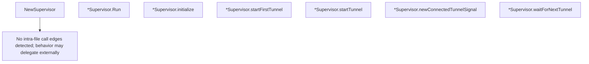

# Behavior Atom: supervisor/supervisor.go

## Source Anchor

- Go source: [cloudflare/cloudflared@2026.3.0/supervisor/supervisor.go](https://github.com/cloudflare/cloudflared/blob/2026.3.0/supervisor/supervisor.go)
- Package: supervisor
- Module group: supervisor

## Behavioral Responsibility

Runtime lifecycle and orchestration behavior.

## Entry Points

- NewSupervisor(config *TunnelConfig, orchestrator*orchestration.Orchestrator, reconnectCh chan ReconnectSignal, gracefulShutdownC <-chan struct{}) (*Supervisor, error) (line 59)
- (*Supervisor) Run(ctx context.Context, connectedSignal*signal.Signal) error (line 112)

## Internal Function Surface

- (*Supervisor) initialize(ctx context.Context, connectedSignal*signal.Signal) error (line 205)
- (*Supervisor) startFirstTunnel(ctx context.Context, connectedSignal*signal.Signal) (line 250)
- (*Supervisor) startTunnel(ctx context.Context, index int, connectedSignal*signal.Signal) (line 303)
- (*Supervisor) newConnectedTunnelSignal(index int)*signal.Signal (line 313)
- (*Supervisor) waitForNextTunnel(index int) bool (line 321)

## Input Contract

- func-param:config *TunnelConfig
- func-param:connectedSignal *signal.Signal
- func-param:ctx context.Context
- func-param:gracefulShutdownC <-chan struct{}
- func-param:index int
- func-param:orchestrator *orchestration.Orchestrator
- func-param:reconnectCh chan ReconnectSignal

## Output Contract

- metrics emission
- return:*Supervisor
- return:*signal.Signal
- return:bool
- return:error
- stdout/stderr or structured logs

## Side Effects and State Transitions

- network I/O
- concurrency primitives
- timers and scheduling

## Branching and Failure Semantics

- Branch density: if=18, switch=2, select=2
- error-return paths
- fallback/default branches

## Import and Dependency Surface

- context
- errors
- github.com/cloudflare/cloudflared/connection
- github.com/cloudflare/cloudflared/edgediscovery
- github.com/cloudflare/cloudflared/orchestration
- github.com/cloudflare/cloudflared/quic/v3
- github.com/cloudflare/cloudflared/retry
- github.com/cloudflare/cloudflared/signal
- github.com/cloudflare/cloudflared/tunnelstate
- github.com/prometheus/client_golang/prometheus
- github.com/quic-go/quic-go
- github.com/rs/zerolog
- net
- strings
- time

## Go-Impl Flow (Intra-file)

## Accuracy Notes

- Generated from Go AST parsing and source text pattern extraction.
- Source link is authoritative for disputed semantics; keep this atom synchronized with the linked file.

## Rust Porting Notes

- **HA connection loop**: `Run` spawns per-connection goroutines via `errgroup` → `tokio::task::JoinSet` with per-connection cancellation tokens.
- **Edge discovery**: `edgediscovery.Edge` address allocator → async `EdgeDiscovery` trait with `get_addr(conn_index)` method.
- **Retry backoff**: `retry.BackoffHandler` integration → compose with the backoff atom's Rust equivalent (see [atoms/retry/backoffhandler](../retry/backoffhandler.md)).
- **Reconnect signal**: `chan ReconnectSignal` → `tokio::sync::mpsc::Receiver<ReconnectSignal>`; the supervisor `select!`s on reconnect, shutdown, and connection errors.
- **Prometheus metrics**: `prometheus.Counter`/`Gauge` → `metrics` crate macros (`counter!`, `gauge!`) or `prometheus` Rust crate.
- **Tunnel state tracker**: `tunnelstate.ConnTracker` → shared `Arc<ConnTracker>` with atomic state transitions.
- **QUIC listener**: `quic-go.EarlyListener` → `quinn::Endpoint` with server config.
- **Quirk — 18 if-branches + 2 select**: The `Run` loop mixes connection spawning, error classification, and retry logic — decompose into a state machine enum in Rust (`Connecting`, `Connected`, `Backoff`, `Shutdown`).
