# Behavior Atom: supervisor/tunnel.go

## Source Anchor

- Go source: [cloudflare/cloudflared@2026.3.0/supervisor/tunnel.go](https://github.com/cloudflare/cloudflared/blob/2026.3.0/supervisor/tunnel.go)
- Package: supervisor
- Module group: supervisor

## Behavioral Responsibility

Runtime lifecycle and orchestration behavior.

## Entry Points

- StartTunnelDaemon(ctx context.Context, config *TunnelConfig, orchestrator*orchestration.Orchestrator, connectedSignal *signal.Signal, reconnectCh chan ReconnectSignal, graceShutdownC <-chan struct{}) error (line 86)
- NewConnectivityError(hasReachedMaxRetries bool) *ConnectivityError (line 105)
- (*ConnectivityError) Error() string (line 111)
- (*ConnectivityError) HasReachedMaxRetries() bool (line 115)
- NewIPAddrFallback(maxRetries uint8) *ipAddrFallback (line 129)
- (*ipAddrFallback) ShouldGetNewAddress(connIndex uint8, err error) (needsNewAddress bool, connectivityError error) (line 145)
- (*EdgeTunnelServer) Serve(ctx context.Context, connIndex uint8, protocolFallback*protocolFallback, connectedSignal *signal.Signal) error (line 188)
- (unrecoverableError) Error() string (line 500)
- (*connectedFuse) Connected() (line 704)
- (*connectedFuse) IsConnected() bool (line 709)

## Internal Function Surface

- (*TunnelConfig) connectionOptions(originLocalAddr string, previousAttempts uint8)*client.ConnectionOptionsSnapshot (line 79)
- (*protocolFallback) reset() (line 295)
- (*protocolFallback) fallback(fallback connection.Protocol) (line 300)
- selectNextProtocol(connLog *zerolog.Logger, protocolBackoff*protocolFallback, selector connection.ProtocolSelector, cause error) bool (line 308)
- isQuicBroken(cause error) bool (line 347)
- (*EdgeTunnelServer) serveTunnel(ctx context.Context, connLog*ConnAwareLogger, addr *allregions.EdgeAddr, connIndex uint8, fuse*booleanFuse, backoff *protocolFallback, protocol connection.Protocol) (err error, recoverable bool) (line 363)
- (*EdgeTunnelServer) serveConnection(ctx context.Context, connLog*ConnAwareLogger, addr *allregions.EdgeAddr, connIndex uint8, fuse*booleanFuse, backoff *protocolFallback, protocol connection.Protocol) (err error, recoverable bool) (line 429)
- (*EdgeTunnelServer) serveHTTP2(ctx context.Context, connLog*ConnAwareLogger, tlsServerConn net.Conn, connOptions *client.ConnectionOptionsSnapshot, controlStreamHandler connection.ControlStreamHandler, connIndex uint8) error (line 504)
- (*EdgeTunnelServer) serveQUIC(ctx context.Context, edgeAddr netip.AddrPort, connLogger*ConnAwareLogger, connOptions *client.ConnectionOptionsSnapshot, controlStreamHandler connection.ControlStreamHandler, connIndex uint8) (err error, recoverable bool) (line 546)
- (*EdgeTunnelServer) reportErrorToSentry(err error, pqMode features.PostQuantumMode) (line 670)
- listenReconnect(ctx context.Context, reconnectCh <-chan ReconnectSignal, gracefulShutdownCh <-chan struct{}) error (line 688)

## Input Contract

- func-param:addr *allregions.EdgeAddr
- func-param:backoff *protocolFallback
- func-param:cause error
- func-param:config *TunnelConfig
- func-param:connIndex uint8
- func-param:connLog *ConnAwareLogger
- func-param:connLog *zerolog.Logger
- func-param:connLogger *ConnAwareLogger
- func-param:connOptions *client.ConnectionOptionsSnapshot
- func-param:connectedSignal *signal.Signal
- func-param:controlStreamHandler connection.ControlStreamHandler
- func-param:ctx context.Context
- func-param:edgeAddr netip.AddrPort
- func-param:err error
- func-param:fallback connection.Protocol
- func-param:fuse *booleanFuse
- func-param:graceShutdownC <-chan struct{}
- func-param:gracefulShutdownCh <-chan struct{}
- func-param:hasReachedMaxRetries bool
- func-param:maxRetries uint8
- func-param:orchestrator *orchestration.Orchestrator
- func-param:originLocalAddr string
- func-param:pqMode features.PostQuantumMode
- func-param:previousAttempts uint8
- func-param:protocol connection.Protocol
- func-param:protocolBackoff *protocolFallback
- func-param:protocolFallback *protocolFallback
- func-param:reconnectCh <-chan ReconnectSignal
- func-param:reconnectCh chan ReconnectSignal
- func-param:selector connection.ProtocolSelector
- func-param:tlsServerConn net.Conn

## Output Contract

- return:*ConnectivityError
- return:*client.ConnectionOptionsSnapshot
- return:*ipAddrFallback
- return:bool
- return:connectivityError error
- return:err error
- return:error
- return:needsNewAddress bool
- return:recoverable bool
- return:string
- stdout/stderr or structured logs

## Side Effects and State Transitions

- network I/O
- concurrency primitives

## Branching and Failure Semantics

- Branch density: if=34, switch=4, select=2
- error-return paths
- fallback/default branches

## Import and Dependency Surface

- context
- crypto/tls
- fmt
- github.com/cloudflare/cloudflared/client
- github.com/cloudflare/cloudflared/connection
- github.com/cloudflare/cloudflared/edgediscovery
- github.com/cloudflare/cloudflared/edgediscovery/allregions
- github.com/cloudflare/cloudflared/features
- github.com/cloudflare/cloudflared/fips
- github.com/cloudflare/cloudflared/ingress
- github.com/cloudflare/cloudflared/ingress/origins
- github.com/cloudflare/cloudflared/management
- github.com/cloudflare/cloudflared/orchestration
- github.com/cloudflare/cloudflared/quic
- github.com/cloudflare/cloudflared/quic/v3
- github.com/cloudflare/cloudflared/retry
- github.com/cloudflare/cloudflared/signal
- github.com/cloudflare/cloudflared/tunnelrpc/pogs
- github.com/cloudflare/cloudflared/tunnelstate
- github.com/getsentry/sentry-go
- github.com/pkg/errors
- github.com/quic-go/quic-go
- github.com/rs/zerolog
- golang.org/x/sync/errgroup
- net
- net/netip
- runtime/debug
- strings
- sync
- time

## Go-Impl Flow (Intra-file)

```mermaid
flowchart TD
    F1["*TunnelConfig.connectionOptions"]
    F2["StartTunnelDaemon"]
    F3["NewConnectivityError"]
    F4["*ConnectivityError.Error"]
    F5["*ConnectivityError.HasReachedMaxRetries"]
    F6["NewIPAddrFallback"]
    F7["*ipAddrFallback.ShouldGetNewAddress"]
    F8["*EdgeTunnelServer.Serve"]
    F9["*protocolFallback.reset"]
    F10["*protocolFallback.fallback"]
    F11["selectNextProtocol"]
    F12["isQuicBroken"]
    F13["*EdgeTunnelServer.serveTunnel"]
    F14["*EdgeTunnelServer.serveConnection"]
    F15["unrecoverableError.Error"]
    F16["*EdgeTunnelServer.serveHTTP2"]
    F17["*EdgeTunnelServer.serveQUIC"]
    F18["*EdgeTunnelServer.reportErrorToSentry"]
    F19["listenReconnect"]
    F20["*connectedFuse.Connected"]
    F21["*connectedFuse.IsConnected"]
    F7 --> F3
    F8 --> F11
    F11 --> F12
    F16 --> F19
    F17 --> F19
```

## Accuracy Notes

- Generated from Go AST parsing and source text pattern extraction.
- Source link is authoritative for disputed semantics; keep this atom synchronized with the linked file.

## Rust Porting Notes

- **Task group**: `errgroup` goroutine management → `tokio::task::JoinSet` with first-error propagation or custom structured concurrency.
- **Protocol fallback**: `protocolFallback` struct with reset/fallback methods → Rust enum state machine (`enum ProtocolState { Current(Protocol), FallenBack(Protocol) }`) with explicit transitions.
- **Shutdown signals**: Multiple `<-chan struct{}` channels → `tokio_util::sync::CancellationToken` tree (parent for daemon, children for per-connection).
- **TLS configuration**: `crypto/tls` → `rustls::ClientConfig` with `webpki-roots` or custom CA store.
- **QUIC transport**: `quic-go` listener/dialer → `quinn` crate with matching ALPN and transport parameters.
- **Connection index**: `connIndex uint8` used as array index and log tag → newtype `ConnIndex(u8)` for type safety.
- **Sentry reporting**: `sentry-go` → `sentry` crate; `debug.Stack()` → `std::backtrace::Backtrace::capture()`.
- **IP address fallback**: `ipAddrFallback` with per-connection retry counters → Rust struct with `HashMap<ConnIndex, u8>` or array-backed counter.
- **Connected fuse**: `connectedFuse` one-shot → `tokio::sync::Notify` or `tokio::sync::watch` channel broadcasting connection state.
- **Quirk — recoverable vs unrecoverable**: `serveTunnel` returns `(error, bool)` indicating recoverability — in Rust, model as `Result<(), TunnelError>` where `TunnelError` enum variants encode recoverability.
- **Quirk — 34 if-branches + 4 switches**: `Serve` loop has dense branching; decompose into match-based dispatch on typed enums rather than nested conditionals.
