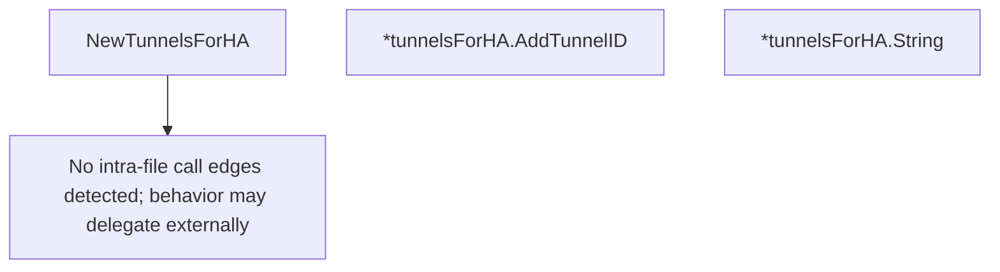

# Behavior Atom: supervisor/tunnelsforha.go

## Source Anchor

- Go source: [cloudflare/cloudflared@2026.3.0/supervisor/tunnelsforha.go](https://github.com/cloudflare/cloudflared/blob/2026.3.0/supervisor/tunnelsforha.go)
- Package: supervisor
- Module group: supervisor

## Behavioral Responsibility

Runtime lifecycle and orchestration behavior.

## Entry Points

- NewTunnelsForHA() tunnelsForHA (line 18)
- (*tunnelsForHA) AddTunnelID(haConn uint8, tunnelID string) (line 35)
- (*tunnelsForHA) String() string (line 46)

## Internal Function Surface

- None detected.

## Input Contract

- func-param:haConn uint8
- func-param:tunnelID string

## Output Contract

- metrics emission
- return:string
- return:tunnelsForHA

## Side Effects and State Transitions

- concurrency primitives

## Branching and Failure Semantics

- Branch density: if=1, switch=0, select=0
- No explicit failure pattern markers found in static scan.

## Import and Dependency Surface

- fmt
- github.com/prometheus/client_golang/prometheus
- sync

## Go-Impl Flow (Intra-file)

## Rust Porting Notes

- **Mutex-protected map**: `tunnelsForHA` holds tunnel IDs behind `sync.Mutex` → `Arc<Mutex<HashMap<ConnIndex, Uuid>>>` or `parking_lot::Mutex` for synchronous access.
- **Prometheus gauge**: Emits HA tunnel count as a metric → update an `IntGauge` inside `AddTunnelID()` after map insertion.
- **Display/String**: `String()` method for human-readable output → implement `std::fmt::Display` on the HA tracker struct.
- **Quirk — lock scope**: Ensure the Rust mutex guard is dropped before emitting metrics to avoid holding the lock across I/O boundaries.

## Accuracy Notes

- Generated from Go AST parsing and source text pattern extraction.
- Source link is authoritative for disputed semantics; keep this atom synchronized with the linked file.
