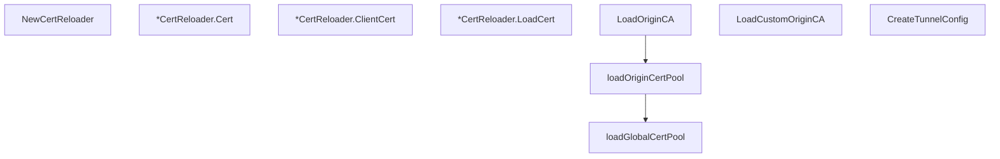

# Behavior Atom: tlsconfig/certreloader.go

## Source Anchor

- Go source: [cloudflare/cloudflared@2026.3.0/tlsconfig/certreloader.go](https://github.com/cloudflare/cloudflared/blob/2026.3.0/tlsconfig/certreloader.go)
- Package: tlsconfig
- Module group: tlsconfig

## Behavioral Responsibility

Configuration, identity, and credential handling behavior.

## Entry Points

- NewCertReloader(certPath string, keyPath string) (*CertReloader, error) (line 32)
- (*CertReloader) Cert(clientHello*tls.ClientHelloInfo) (*tls.Certificate, error) (line 44)
- (*CertReloader) ClientCert(certRequestInfo*tls.CertificateRequestInfo) (*tls.Certificate, error) (line 52)
- (*CertReloader) LoadCert() error (line 60)
- LoadOriginCA(originCAPoolFilename string, log *zerolog.Logger) (*x509.CertPool, error) (line 75)
- LoadCustomOriginCA(originCAFilename string) (*x509.CertPool, error) (line 99)
- CreateTunnelConfig(c *cli.Context, serverName string) (*tls.Config, error) (line 130)

## Internal Function Surface

- loadOriginCertPool(originCAPoolPEM []byte, log *zerolog.Logger) (*x509.CertPool, error) (line 163)
- loadGlobalCertPool(log *zerolog.Logger) (*x509.CertPool, error) (line 180)

## Input Contract

- CLI flags and command arguments
- func-param:c *cli.Context
- func-param:certPath string
- func-param:certRequestInfo *tls.CertificateRequestInfo
- func-param:clientHello *tls.ClientHelloInfo
- func-param:keyPath string
- func-param:log *zerolog.Logger
- func-param:originCAFilename string
- func-param:originCAPoolFilename string
- func-param:originCAPoolPEM []byte
- func-param:serverName string

## Output Contract

- return:*CertReloader
- return:*tls.Certificate
- return:*tls.Config
- return:*x509.CertPool
- return:error
- stdout/stderr or structured logs

## Side Effects and State Transitions

- network I/O
- filesystem I/O
- concurrency primitives

## Branching and Failure Semantics

- Branch density: if=24, switch=0, select=0
- error-return paths

## Import and Dependency Surface

- crypto/tls
- crypto/x509
- fmt
- github.com/getsentry/sentry-go
- github.com/pkg/errors
- github.com/rs/zerolog
- github.com/urfave/cli/v2
- os
- runtime
- sync

## Go-Impl Flow (Intra-file)

## Rust Porting Notes

- **RWMutex cert hot-reload**: `sync.RWMutex`-guarded cert/key pair → `Arc<RwLock<Arc<rustls::sign::CertifiedKey>>>` with `rustls::server::ResolvesServerCert` trait.
- **Filesystem watch**: Cert file change detection → `notify` crate watcher triggering reload.
- **x509 cert pool**: `x509.NewCertPool` + `AppendCertsFromPEM` → `rustls::RootCertStore::add_parsable_certificates()`.
- **Quirk — 24 if-branches**: Cert loading + validation; decompose into `load_cert()` and `validate_cert()` functions.

## Accuracy Notes

- Generated from Go AST parsing and source text pattern extraction.
- Source link is authoritative for disputed semantics; keep this atom synchronized with the linked file.
