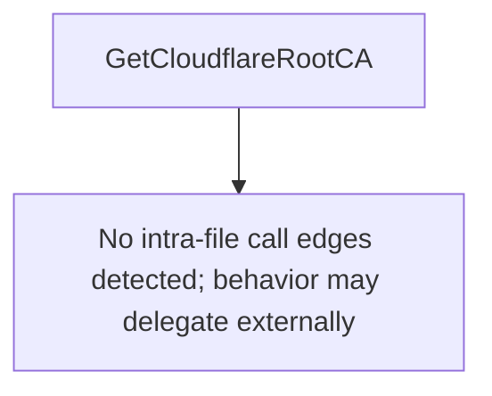

# Behavior Atom: tlsconfig/cloudflare_ca.go

## Source Anchor

- Go source: [cloudflare/cloudflared@2026.3.0/tlsconfig/cloudflare_ca.go](https://github.com/cloudflare/cloudflared/blob/2026.3.0/tlsconfig/cloudflare_ca.go)
- Package: tlsconfig
- Module group: tlsconfig

## Behavioral Responsibility

Configuration, identity, and credential handling behavior.

## Entry Points

- GetCloudflareRootCA() ([]*x509.Certificate, error) (line 89)

## Internal Function Surface

- None detected.

## Input Contract

- Inputs are indirect through callers; no direct input pattern detected statically.

## Output Contract

- return:[]*x509.Certificate
- return:error

## Side Effects and State Transitions

- No high-signal side effect pattern detected in static scan.

## Branching and Failure Semantics

- Branch density: if=3, switch=0, select=0
- error-return paths

## Import and Dependency Surface

- crypto/x509
- encoding/pem

## Go-Impl Flow (Intra-file)

## Rust Porting Notes

- **Embedded PEM cert**: Hardcoded Cloudflare CA PEM string + `x509.NewCertPool` → `include_str!()` + `rustls_pemfile::certs()` + `RootCertStore::add()`.
- **Quirk — 3 if-branches**: PEM parse validation; `?` chain.

## Accuracy Notes

- Generated from Go AST parsing and source text pattern extraction.
- Source link is authoritative for disputed semantics; keep this atom synchronized with the linked file.
