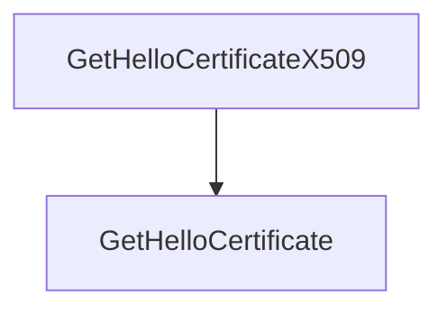

# Behavior Atom: tlsconfig/hello_ca.go

## Source Anchor

- Go source: [cloudflare/cloudflared@2026.3.0/tlsconfig/hello_ca.go](https://github.com/cloudflare/cloudflared/blob/2026.3.0/tlsconfig/hello_ca.go)
- Package: tlsconfig
- Module group: tlsconfig

## Behavioral Responsibility

Configuration, identity, and credential handling behavior.

## Entry Points

- GetHelloCertificate() (tls.Certificate, error) (line 39)
- GetHelloCertificateX509() (*x509.Certificate, error) (line 43)

## Internal Function Surface

- None detected.

## Input Contract

- Inputs are indirect through callers; no direct input pattern detected statically.

## Output Contract

- return:*x509.Certificate
- return:error
- return:tls.Certificate

## Side Effects and State Transitions

- No high-signal side effect pattern detected in static scan.

## Branching and Failure Semantics

- Branch density: if=1, switch=0, select=0
- error-return paths

## Import and Dependency Surface

- crypto/tls
- crypto/x509

## Go-Impl Flow (Intra-file)

## Rust Porting Notes

- **Embedded cert constant**: Hardcoded hello-world CA PEM → `include_str!()` + `rustls_pemfile::certs()`. Trivial.

## Accuracy Notes

- Generated from Go AST parsing and source text pattern extraction.
- Source link is authoritative for disputed semantics; keep this atom synchronized with the linked file.
