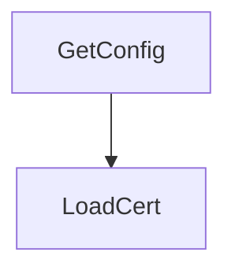

# Behavior Atom: tlsconfig/tlsconfig.go

## Source Anchor

- Go source: [cloudflare/cloudflared@2026.3.0/tlsconfig/tlsconfig.go](https://github.com/cloudflare/cloudflared/blob/2026.3.0/tlsconfig/tlsconfig.go)
- Package: tlsconfig
- Module group: tlsconfig

## Behavioral Responsibility

Configuration, identity, and credential handling behavior.

## Entry Points

- GetConfig(p *TLSParameters) (*tls.Config, error) (line 28)
- LoadCert(certPaths []string) (*x509.CertPool, error) (line 90)

## Internal Function Surface

- None detected.

## Input Contract

- func-param:certPaths []string
- func-param:p *TLSParameters

## Output Contract

- return:*tls.Config
- return:*x509.CertPool
- return:error

## Side Effects and State Transitions

- network I/O
- filesystem I/O

## Branching and Failure Semantics

- Branch density: if=12, switch=0, select=0
- error-return paths

## Import and Dependency Surface

- crypto/tls
- crypto/x509
- github.com/pkg/errors
- os

## Go-Impl Flow (Intra-file)

## Rust Porting Notes

- **TLS config builder**: `crypto/tls.Config` with cert pool + min version → `rustls::ClientConfig::builder().with_root_certificates(root_store).with_no_client_auth()`.
- **System cert pool**: `x509.SystemCertPool()` → `rustls_native_certs::load_native_certs()` + `RootCertStore::add_parsable_certificates()`.
- **Quirk — 12 if-branches**: TLS option validation; use builder pattern with `?` chain.

## Accuracy Notes

- Generated from Go AST parsing and source text pattern extraction.
- Source link is authoritative for disputed semantics; keep this atom synchronized with the linked file.
