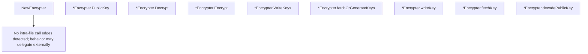

# Behavior Atom: token/encrypt.go

## Source Anchor

- Go source: [cloudflare/cloudflared@2026.3.0/token/encrypt.go](https://github.com/cloudflare/cloudflared/blob/2026.3.0/token/encrypt.go)
- Package: token
- Module group: token

## Behavioral Responsibility

Configuration, identity, and credential handling behavior.

## Entry Points

- NewEncrypter(privateKey string, publicKey string) (*Encrypter, error) (line 48)
- (*Encrypter) PublicKey() string (line 59)
- (*Encrypter) Decrypt(data []byte, senderPublicKey string) ([]byte, error) (line 68)
- (*Encrypter) Encrypt(data []byte, recipientPublicKey string) ([]byte, error) (line 87)
- (*Encrypter) WriteKeys(privateKey string, publicKey string) error (line 103)

## Internal Function Surface

- (*Encrypter) fetchOrGenerateKeys(privateKey string, publicKey string) (*[32]byte, *[32]byte, error) (line 111)
- (*Encrypter) writeKey(key []byte, pemType string, filename string) error (line 129)
- (*Encrypter) fetchKey(filename string) (*[32]byte, error) (line 149)
- (*Encrypter) decodePublicKey(key string) (*[32]byte, error) (line 168)

## Input Contract

- func-param:data []byte
- func-param:filename string
- func-param:key []byte
- func-param:key string
- func-param:pemType string
- func-param:privateKey string
- func-param:publicKey string
- func-param:recipientPublicKey string
- func-param:senderPublicKey string

## Output Contract

- HTTP response writes
- filesystem writes
- return:*Encrypter
- return:*[32]byte
- return:[]byte
- return:error
- return:string
- stdout/stderr or structured logs

## Side Effects and State Transitions

- filesystem I/O

## Branching and Failure Semantics

- Branch density: if=15, switch=0, select=0
- error-return paths
- fatal log/termination paths

## Import and Dependency Surface

- bytes
- crypto/rand
- encoding/base64
- encoding/pem
- errors
- golang.org/x/crypto/nacl/box
- io
- os

## Go-Impl Flow (Intra-file)

## Rust Porting Notes

- **NaCl box encryption**: `golang.org/x/crypto/nacl/box` → `crypto_box` crate (X25519 + XSalsa20Poly1305) or `sodiumoxide::crypto::box_`.
- **PEM key I/O**: PEM-encoded public/private key files → `pem` crate for parsing + `std::fs::read`/`write`.
- **Nonce generation**: `crypto/rand` for 24-byte nonce → `rand::thread_rng().fill_bytes(&mut nonce)`.

## Accuracy Notes

- Generated from Go AST parsing and source text pattern extraction.
- Source link is authoritative for disputed semantics; keep this atom synchronized with the linked file.
