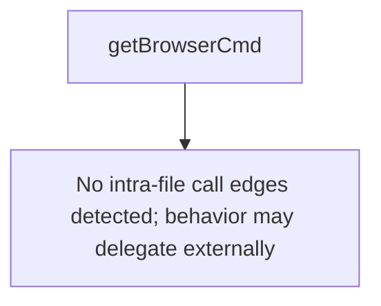

# Behavior Atom: token/launch_browser_darwin.go

## Source Anchor

- Go source: [cloudflare/cloudflared@2026.3.0/token/launch_browser_darwin.go](https://github.com/cloudflare/cloudflared/blob/2026.3.0/token/launch_browser_darwin.go)
- Package: token
- Module group: token

## Behavioral Responsibility

Configuration, identity, and credential handling behavior.

## Entry Points

- No exported/main/init entry point detected; behavior is internal support logic.

## Internal Function Surface

- getBrowserCmd(url string) *exec.Cmd (line 9)

## Input Contract

- func-param:url string

## Output Contract

- return:*exec.Cmd

## Side Effects and State Transitions

- subprocess execution

## Branching and Failure Semantics

- Branch density: if=0, switch=0, select=0
- No explicit failure pattern markers found in static scan.

## Import and Dependency Surface

- os/exec

## Go-Impl Flow (Intra-file)

## Rust Porting Notes

- **Build tag**: `//go:build darwin` → `#[cfg(target_os = "macos")]`.
- **Browser launch**: `exec.Command("open", url)` → `std::process::Command::new("open").arg(url).spawn()` or `open` crate.

## Accuracy Notes

- Generated from Go AST parsing and source text pattern extraction.
- Source link is authoritative for disputed semantics; keep this atom synchronized with the linked file.
