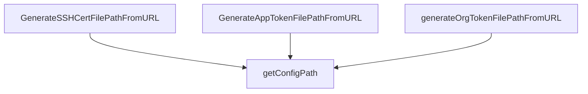

# Behavior Atom: token/path.go

## Source Anchor

- Go source: [cloudflare/cloudflared@2026.3.0/token/path.go](https://github.com/cloudflare/cloudflared/blob/2026.3.0/token/path.go)
- Package: token
- Module group: token

## Behavioral Responsibility

Configuration, identity, and credential handling behavior.

## Entry Points

- GenerateSSHCertFilePathFromURL(url *url.URL, suffix string) (string, error) (line 16)
- GenerateAppTokenFilePathFromURL(appDomain string, aud string, suffix string) (string, error) (line 26)

## Internal Function Surface

- generateOrgTokenFilePathFromURL(authDomain string) (string, error) (line 37)
- getConfigPath() (string, error) (line 46)

## Input Contract

- func-param:appDomain string
- func-param:aud string
- func-param:authDomain string
- func-param:suffix string
- func-param:url *url.URL

## Output Contract

- return:error
- return:string

## Side Effects and State Transitions

- No high-signal side effect pattern detected in static scan.

## Branching and Failure Semantics

- Branch density: if=5, switch=0, select=0
- error-return paths

## Import and Dependency Surface

- fmt
- github.com/cloudflare/cloudflared/config
- github.com/mitchellh/go-homedir
- net/url
- os
- path/filepath
- strings

## Go-Impl Flow (Intra-file)

## Rust Porting Notes

- **Home dir expansion**: `go-homedir` for `~` expansion → `dirs::home_dir()` or `home` crate.
- **Config path lookup**: Delegates to `cloudflared/config` package → reuse Rust config module’s path resolution.
- **Quirk — 5 if-branches**: Path validation; straightforward `Option` handling.

## Accuracy Notes

- Generated from Go AST parsing and source text pattern extraction.
- Source link is authoritative for disputed semantics; keep this atom synchronized with the linked file.
