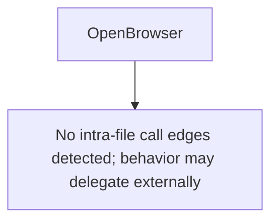

# Behavior Atom: token/shell.go

## Source Anchor

- Go source: [cloudflare/cloudflared@2026.3.0/token/shell.go](https://github.com/cloudflare/cloudflared/blob/2026.3.0/token/shell.go)
- Package: token
- Module group: token

## Behavioral Responsibility

Configuration, identity, and credential handling behavior.

## Entry Points

- OpenBrowser(url string) error (line 4)

## Internal Function Surface

- None detected.

## Input Contract

- func-param:url string

## Output Contract

- return:error

## Side Effects and State Transitions

- No high-signal side effect pattern detected in static scan.

## Branching and Failure Semantics

- Branch density: if=0, switch=0, select=0
- No explicit failure pattern markers found in static scan.

## Import and Dependency Surface

- No imports.

## Go-Impl Flow (Intra-file)

## Rust Porting Notes

- **Thin facade**: Dispatches to platform-specific `getBrowserCmd` → platform-gated module re-export. Trivial.

## Accuracy Notes

- Generated from Go AST parsing and source text pattern extraction.
- Source link is authoritative for disputed semantics; keep this atom synchronized with the linked file.
