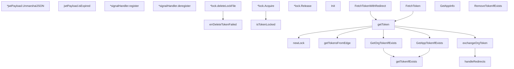

# Behavior Atom: token/token.go

## Source Anchor

- Go source: [cloudflare/cloudflared@2026.3.0/token/token.go](https://github.com/cloudflare/cloudflared/blob/2026.3.0/token/token.go)
- Package: token
- Module group: token

## Behavioral Responsibility

Configuration, identity, and credential handling behavior.

## Entry Points

- (*jwtPayload) UnmarshalJSON(data []byte) error (line 71)
- (*lock) Acquire() error (line 135)
- (*lock) Release() error (line 171)
- Init(version string) (line 182)
- FetchTokenWithRedirect(appURL *url.URL, appInfo*AppInfo, autoClose bool, isFedramp bool, log *zerolog.Logger) (string, error) (line 188)
- FetchToken(appURL *url.URL, appInfo*AppInfo, autoClose bool, isFedramp bool, log *zerolog.Logger) (string, error) (line 194)
- GetAppInfo(reqURL *url.URL) (*AppInfo, error) (line 288)
- GetOrgTokenIfExists(authDomain string) (string, error) (line 398)
- GetAppTokenIfExists(appInfo *AppInfo) (string, error) (line 420)
- RemoveTokenIfExists(appInfo *AppInfo) error (line 456)

## Internal Function Surface

- (jwtPayload) isExpired() bool (line 99)
- (*signalHandler) register(handler func()) (line 103)
- (*signalHandler) deregister() (line 113)
- errDeleteTokenFailed(lockFilePath string) error (line 118)
- newLock(path string) *lock (line 123)
- (*lock) deleteLockFile() error (line 164)
- isTokenLocked(lockFilePath string) bool (line 177)
- getToken(appURL *url.URL, appInfo*AppInfo, useHostOnly bool, autoClose bool, isFedramp bool, log *zerolog.Logger) (string, error) (line 199)
- getTokensFromEdge(appURL *url.URL, appAUD string, appTokenPath string, orgTokenPath string, useHostOnly bool, autoClose bool, isFedramp bool, log*zerolog.Logger) (string, error) (line 257)
- handleRedirects(req *http.Request, via []*http.Request, orgToken string) error (line 334)
- exchangeOrgToken(appURL *url.URL, orgToken string) (string, error) (line 364)
- getTokenIfExists(path string) (*jose.JSONWebSignature, error) (line 443)

## Input Contract

- HTTP requests
- OS signals
- func-param:appAUD string
- func-param:appInfo *AppInfo
- func-param:appTokenPath string
- func-param:appURL *url.URL
- func-param:authDomain string
- func-param:autoClose bool
- func-param:data []byte
- func-param:handler func()
- func-param:isFedramp bool
- func-param:lockFilePath string
- func-param:log *zerolog.Logger
- func-param:orgToken string
- func-param:orgTokenPath string
- func-param:path string
- func-param:req *http.Request
- func-param:reqURL *url.URL
- func-param:useHostOnly bool
- func-param:version string
- func-param:via []*http.Request
- serialized configuration payloads

## Output Contract

- filesystem writes
- return:*AppInfo
- return:*jose.JSONWebSignature
- return:*lock
- return:bool
- return:error
- return:string
- stdout/stderr or structured logs

## Side Effects and State Transitions

- network I/O
- filesystem I/O
- concurrency primitives
- signal handling

## Branching and Failure Semantics

- Branch density: if=50, switch=1, select=0
- error-return paths
- fatal log/termination paths
- fallback/default branches

## Import and Dependency Surface

- context
- encoding/json
- fmt
- github.com/cloudflare/cloudflared/config
- github.com/cloudflare/cloudflared/retry
- github.com/go-jose/go-jose/v4
- github.com/pkg/errors
- github.com/rs/zerolog
- net/http
- net/url
- os
- os/signal
- strings
- syscall
- time

## Go-Impl Flow (Intra-file)

## Rust Porting Notes

- **OS signal handling**: `os/signal.Notify(SIGINT, SIGTERM)` → `tokio::signal::ctrl_c()` or `signal-hook` crate.
- **File-based lock + sync.Mutex**: Token file locking → `fd-lock` or `file-lock` crate + `tokio::sync::Mutex`.
- **JWT parsing**: `go-jose/v4` for JWT verification → `jsonwebtoken` crate with `Validation`.
- **Package-level Init()**: `Init()` function setting global state → `once_cell::sync::Lazy` or `LazyLock`.
- **HTTP redirect interception**: Custom `CheckRedirect` in `net/http.Client` → `reqwest::ClientBuilder::redirect(Policy::none())` + manual follow.
- **Quirk — 50 if-branches**: Extremely high branching; decompose into smaller functions.

## Accuracy Notes

- Generated from Go AST parsing and source text pattern extraction.
- Source link is authoritative for disputed semantics; keep this atom synchronized with the linked file.
