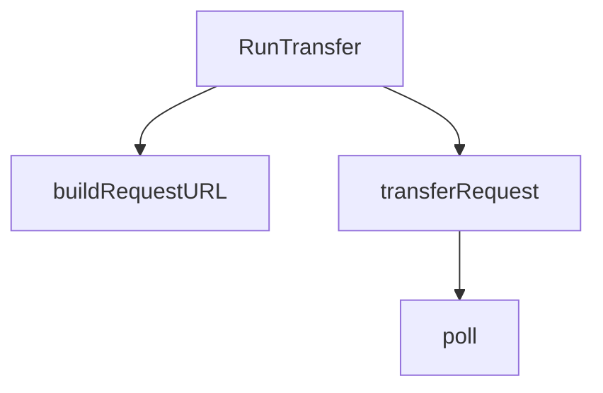

# Behavior Atom: token/transfer.go

## Source Anchor

- Go source: [cloudflare/cloudflared@2026.3.0/token/transfer.go](https://github.com/cloudflare/cloudflared/blob/2026.3.0/token/transfer.go)
- Package: token
- Module group: token

## Behavioral Responsibility

Configuration, identity, and credential handling behavior.

## Entry Points

- RunTransfer(transferURL *url.URL, appAUD string, resourceName string, key string, value string, shouldEncrypt bool, useHostOnly bool, autoClose bool, fedramp bool, log*zerolog.Logger) ([]byte, error) (line 29)

## Internal Function Surface

- buildRequestURL(baseURL *url.URL, appAUD string, key string, value string, cli bool, useHostOnly bool, autoClose bool) (string, error) (line 85)
- transferRequest(requestURL string, log *zerolog.Logger) ([]byte, string, error) (line 110)
- poll(client *http.Client, requestURL string, log*zerolog.Logger) ([]byte, string, error) (line 126)

## Input Contract

- func-param:appAUD string
- func-param:autoClose bool
- func-param:baseURL *url.URL
- func-param:cli bool
- func-param:client *http.Client
- func-param:fedramp bool
- func-param:key string
- func-param:log *zerolog.Logger
- func-param:requestURL string
- func-param:resourceName string
- func-param:shouldEncrypt bool
- func-param:transferURL *url.URL
- func-param:useHostOnly bool
- func-param:value string

## Output Contract

- return:[]byte
- return:error
- return:string
- stdout/stderr or structured logs

## Side Effects and State Transitions

- network I/O

## Branching and Failure Semantics

- Branch density: if=20, switch=0, select=0
- error-return paths

## Import and Dependency Surface

- bytes
- encoding/base64
- fmt
- github.com/pkg/errors
- github.com/rs/zerolog
- io
- net/http
- net/url
- os
- time

## Go-Impl Flow (Intra-file)

## Rust Porting Notes

- **HTTP polling loop**: `time.Sleep` + `net/http.Get` retry loop → `tokio::time::sleep` + `reqwest::get()` in async loop with backoff.
- **Base64 encoding**: `encoding/base64` for token transfer → `base64::engine::general_purpose::URL_SAFE`.
- **Error wrapping**: `pkg/errors.Wrap` → `thiserror` or `anyhow::Context`.
- **Quirk — 20 if-branches**: Retry logic + response validation; use `Result` chains.

## Accuracy Notes

- Generated from Go AST parsing and source text pattern extraction.
- Source link is authoritative for disputed semantics; keep this atom synchronized with the linked file.
