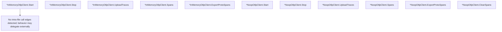

# Behavior Atom: tracing/client.go

## Source Anchor

- Go source: [cloudflare/cloudflared@2026.3.0/tracing/client.go](https://github.com/cloudflare/cloudflared/blob/2026.3.0/tracing/client.go)
- Package: tracing
- Module group: tracing

## Behavioral Responsibility

Core package behavior anchored to this source file.

## Entry Points

- (*InMemoryOtlpClient) Start(_ context.Context) error (line 38)
- (*InMemoryOtlpClient) Stop(_ context.Context) error (line 42)
- (*InMemoryOtlpClient) UploadTraces(_ context.Context, protoSpans []*tracepb.ResourceSpans) error (line 47)
- (*InMemoryOtlpClient) Spans() (string, error) (line 60)
- (*InMemoryOtlpClient) ExportProtoSpans() ([]byte, error) (line 69)
- (*NoopOtlpClient) Start(_ context.Context) error (line 89)
- (*NoopOtlpClient) Stop(_ context.Context) error (line 93)
- (*NoopOtlpClient) UploadTraces(_context.Context,_ []*tracepb.ResourceSpans) error (line 97)
- (*NoopOtlpClient) Spans() (string, error) (line 102)
- (*NoopOtlpClient) ExportProtoSpans() ([]byte, error) (line 107)
- (*NoopOtlpClient) ClearSpans() (line 111)

## Internal Function Surface

- None detected.

## Input Contract

- func-param:_ []*tracepb.ResourceSpans
- func-param:_ context.Context
- func-param:protoSpans []*tracepb.ResourceSpans

## Output Contract

- return:[]byte
- return:error
- return:string

## Side Effects and State Transitions

- concurrency primitives

## Branching and Failure Semantics

- Branch density: if=4, switch=0, select=0
- error-return paths

## Import and Dependency Surface

- context
- encoding/base64
- errors
- go.opentelemetry.io/proto/otlp/collector/trace/v1
- go.opentelemetry.io/proto/otlp/trace/v1
- google.golang.org/protobuf/proto
- sync

## Go-Impl Flow (Intra-file)

## Rust Porting Notes

- **Mutex-guarded span collection**: `sync.Mutex` protecting in-memory span list → `Arc<Mutex<Vec<SpanData>>>` or `parking_lot::Mutex`.
- **InMemory + Noop pair**: Two interface implementations → `enum TracingClient { InMemory(InMemoryCollector), Noop }` with `match` dispatch.
- **OTel protobuf deps**: `otlp/trace/v1` + `google.golang.org/protobuf` → `opentelemetry_proto` crate or `prost`-generated types.
- **Quirk — 4 if-branches**: Minimal.

## Accuracy Notes

- Generated from Go AST parsing and source text pattern extraction.
- Source link is authoritative for disputed semantics; keep this atom synchronized with the linked file.
