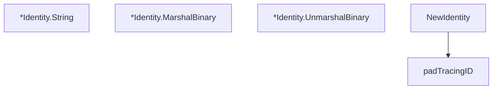

# Behavior Atom: tracing/identity.go

## Source Anchor

- Go source: [cloudflare/cloudflared@2026.3.0/tracing/identity.go](https://github.com/cloudflare/cloudflared/blob/2026.3.0/tracing/identity.go)
- Package: tracing
- Module group: tracing

## Behavioral Responsibility

Core package behavior anchored to this source file.

## Entry Points

- (*Identity) String() string (line 26)
- (*Identity) MarshalBinary() ([]byte, error) (line 30)
- (*Identity) UnmarshalBinary(data []byte) error (line 45)
- NewIdentity(trace string) (*Identity, error) (line 65)

## Internal Function Surface

- padTracingID(tracingID string) (string, error) (line 99)

## Input Contract

- func-param:data []byte
- func-param:trace string
- func-param:tracingID string

## Output Contract

- HTTP response writes
- return:*Identity
- return:[]byte
- return:error
- return:string

## Side Effects and State Transitions

- No high-signal side effect pattern detected in static scan.

## Branching and Failure Semantics

- Branch density: if=11, switch=0, select=0
- error-return paths

## Import and Dependency Surface

- bytes
- encoding/binary
- fmt
- strconv
- strings

## Go-Impl Flow (Intra-file)

## Rust Porting Notes

- **Binary trace ID marshal**: Manual byte encoding of trace/span IDs → `opentelemetry::trace::TraceId::from_bytes()` / `to_bytes()` or manual `[u8; 16]` handling.
- **Quirk — 11 if-branches**: Validation of ID lengths + formats; use fixed-size arrays for compile-time safety.

## Accuracy Notes

- Generated from Go AST parsing and source text pattern extraction.
- Source link is authoritative for disputed semantics; keep this atom synchronized with the linked file.
