# Behavior Atom: tracing/tracing.go

## Source Anchor

- Go source: [cloudflare/cloudflared@2026.3.0/tracing/tracing.go](https://github.com/cloudflare/cloudflared/blob/2026.3.0/tracing/tracing.go)
- Package: tracing
- Module group: tracing

## Behavioral Responsibility

Core package behavior anchored to this source file.

## Entry Points

- init() (line 60)
- Init(version string) (line 69)
- NewTracedHTTPRequest(req *http.Request, connIndex uint8, log*zerolog.Logger) *TracedHTTPRequest (line 80)
- (*TracedHTTPRequest) ToTracedContext()*TracedContext (line 88)
- NewTracedContext(ctx context.Context, traceContext string, log *zerolog.Logger)*TracedContext (line 98)
- (*cfdTracer) Tracer() trace.Tracer (line 137)
- (*cfdTracer) GetSpans() enc string (line 142)
- (*cfdTracer) GetProtoSpans() proto []byte (line 160)
- (*cfdTracer) AddSpans(headers http.Header) (line 179)
- End(span trace.Span) (line 194)
- EndWithErrorStatus(span trace.Span, err error) (line 199)
- EndWithStatusCode(span trace.Span, statusCode int) (line 204)
- NewNoopSpan() trace.Span (line 285)

## Internal Function Surface

- newCfdTracer(ctx context.Context, log *zerolog.Logger)*cfdTracer (line 113)
- endSpan(span trace.Span, upstreamStatusCode int, spanStatusCode codes.Code, err error) (line 209)
- extractTraceFromString(ctx context.Context, trace string) (context.Context, bool) (line 232)
- extractTrace(req *http.Request) (context.Context, bool) (line 258)

## Input Contract

- HTTP requests
- func-param:connIndex uint8
- func-param:ctx context.Context
- func-param:err error
- func-param:headers http.Header
- func-param:log *zerolog.Logger
- func-param:req *http.Request
- func-param:span trace.Span
- func-param:spanStatusCode codes.Code
- func-param:statusCode int
- func-param:trace string
- func-param:traceContext string
- func-param:upstreamStatusCode int
- func-param:version string

## Output Contract

- return:*TracedContext
- return:*TracedHTTPRequest
- return:*cfdTracer
- return:bool
- return:context.Context
- return:enc string
- return:proto []byte
- return:trace.Span
- return:trace.Tracer
- stdout/stderr or structured logs

## Side Effects and State Transitions

- network I/O

## Branching and Failure Semantics

- Branch density: if=15, switch=2, select=0
- error-return paths
- fallback/default branches

## Import and Dependency Surface

- context
- errors
- fmt
- github.com/rs/zerolog
- go.opentelemetry.io/contrib/propagators/jaeger
- go.opentelemetry.io/otel
- go.opentelemetry.io/otel/attribute
- go.opentelemetry.io/otel/codes
- go.opentelemetry.io/otel/exporters/otlp/otlptrace
- go.opentelemetry.io/otel/propagation
- go.opentelemetry.io/otel/sdk/resource
- go.opentelemetry.io/otel/sdk/trace
- go.opentelemetry.io/otel/semconv/v1.7.0
- go.opentelemetry.io/otel/trace
- math
- net/http
- os
- runtime
- strings

## Go-Impl Flow (Intra-file)

```mermaid
flowchart TD
    F1["init"]
    F2["Init"]
    F3["NewTracedHTTPRequest"]
    F4["*TracedHTTPRequest.ToTracedContext"]
    F5["NewTracedContext"]
    F6["newCfdTracer"]
    F7["*cfdTracer.Tracer"]
    F8["*cfdTracer.GetSpans"]
    F9["*cfdTracer.GetProtoSpans"]
    F10["*cfdTracer.AddSpans"]
    F11["End"]
    F12["EndWithErrorStatus"]
    F13["EndWithStatusCode"]
    F14["endSpan"]
    F15["extractTraceFromString"]
    F16["extractTrace"]
    F17["NewNoopSpan"]
    F3 --> F16
    F3 --> F6
    F5 --> F15
    F5 --> F6
    F11 --> F14
    F12 --> F14
    F13 --> F14
```

## Rust Porting Notes

- **OTel SDK setup**: `go.opentelemetry.io/otel` SDK init with Jaeger propagator + OTLP exporter → `opentelemetry_sdk::trace::TracerProvider` + `opentelemetry_otlp::SpanExporter` + `opentelemetry_jaeger_propagator`.
- **init() global tracer**: Package-level tracer registration → `opentelemetry::global::set_tracer_provider()` called once.
- **HTTP header extraction**: `propagation.Extract` from HTTP headers → `opentelemetry::global::get_text_map_propagator().extract(&HeaderExtractor(headers))`.
- **Quirk — 15 if + 2 switch**: SDK configuration branches; decompose into config builder.

## Accuracy Notes

- Generated from Go AST parsing and source text pattern extraction.
- Source link is authoritative for disputed semantics; keep this atom synchronized with the linked file.
