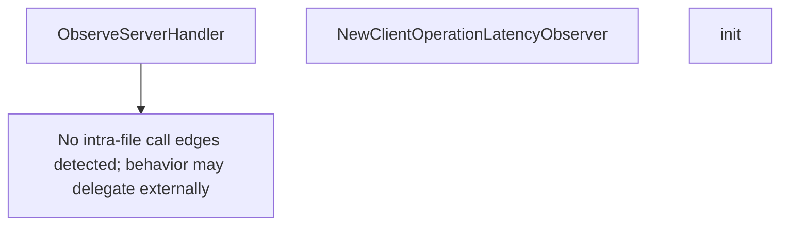

# Behavior Atom: tunnelrpc/metrics/metrics.go

## Source Anchor

- Go source: [cloudflare/cloudflared@2026.3.0/tunnelrpc/metrics/metrics.go](https://github.com/cloudflare/cloudflared/blob/2026.3.0/tunnelrpc/metrics/metrics.go)
- Package: metrics
- Module group: tunnelrpc

## Behavioral Responsibility

Management, diagnostics, and observability behavior.

## Entry Points

- ObserveServerHandler(inner func() error, handler string, method string) error (line 116)
- NewClientOperationLatencyObserver(server string, method string) *prometheus.Timer (line 130)
- init() (line 136)

## Internal Function Surface

- None detected.

## Input Contract

- func-param:handler string
- func-param:inner func() error
- func-param:method string
- func-param:server string

## Output Contract

- metrics emission
- return:*prometheus.Timer
- return:error

## Side Effects and State Transitions

- network I/O

## Branching and Failure Semantics

- Branch density: if=1, switch=0, select=0
- error-return paths

## Import and Dependency Surface

- github.com/prometheus/client_golang/prometheus

## Go-Impl Flow (Intra-file)

## Accuracy Notes

- Generated from Go AST parsing and source text pattern extraction.
- Source link is authoritative for disputed semantics; keep this atom synchronized with the linked file.

## Rust Porting Notes

- **Server handler observer**: `ObserveServerHandler` wraps an RPC handler with latency/error tracking → middleware pattern using `tower::Layer` or manual `Instant::now()` + `elapsed()` instrumentation.
- **Client latency timer**: `NewClientOperationLatencyObserver` → `prometheus::Histogram::start_timer()` or `metrics::histogram!` with operation labels.
- **Init registration**: Go `init()` for global metric registration → `std::sync::LazyLock` or register in a setup function called from `main`.
- **Quirk — handler string labels**: RPC metrics keyed by handler/method name strings — use `&'static str` constants for label values in Rust to avoid allocation.
